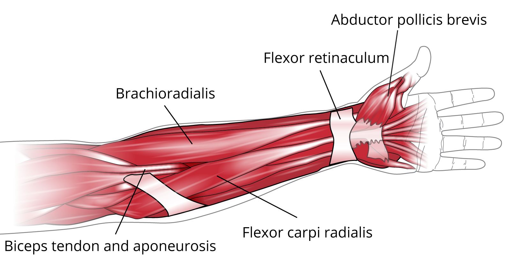
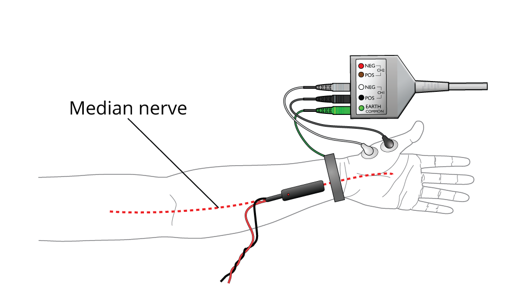
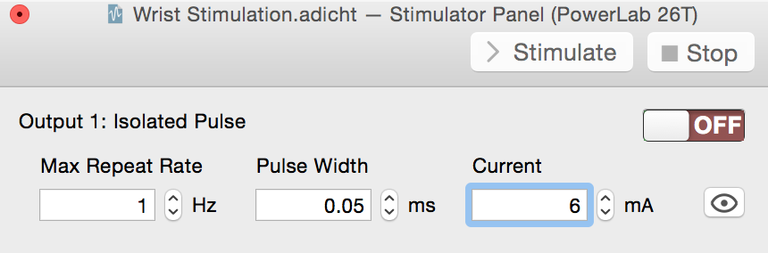
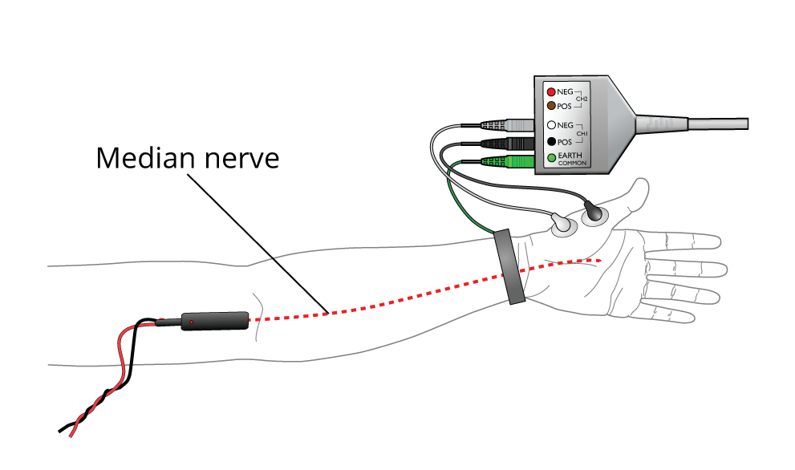

## Quicklinks

+ [Required Equipment](#required-equipment)
+ [Lab Procedure](#procedure)
  + [Exercise 1](#exercise-1-sensory-resolution)
  + [ADInstruments Equipment Setup for Voluntary EMG](#equipment-setup-and-electrode-attachment-for-adinstruments-experiments)
    + [Exercise 2](#exercise-2-alternating-activity-and-coactivation)
  + [ADInstruments Equipment Setup for Evoked EMG](#section-2-evoked-emg-activity)
    + [Exercise 4](#exercise-4-finding-the-median-nerve)
    + [Exercise 5](#exercise-5-evoked-emg-activity)
+ [Data Analysis](#analysis)
  
## Lab Objectives
1. Explore the relationship between electrical activity in neurons and muscular reponses for both evoked and voluntary muscle contractions
2. Test sensory resolution on different parts of the body
3. Learn how to record an electromyogram, or EMG
4. Measure nerve conduction velocity.

## Readings
+ Chapter 16 in Butler et al., *Animal Physiology; an Environmental Perspective*
+ More, HL, JR Hutchinson, DF Collins, DJ Weber, SKH Aung, JM Donelan (2010) Scaling of sensorimotor control in terrestrial mammals. *Proceedings of the Royal Society, B*. **277:** 3563-3568.
  
## Scientific Background

Nervous signals are carried as electrical action potentials along neurons. Within a neuron, an action potential is triggered when the membrane potential reaches threshold (usually about -40 mV), which opens voltage-gated sodium channels. The opening of those channels allows the passive diffusion of $Na^{+}$ ions **into** the cell, which further depolarizes it, pushing the next set of voltage-gated channels over threshold. Once an action potential is initiated, it propagates without further control or change in amplitude – it is known as an **all-or-none** event. 

The velocity of that propagation depends on several factors:

1. The temperature
2. The extent of myelination
3. The axonal **diameter**

Generally, when comparing neurons in the homologous nerves across mammals, temperature and myelination are consistent. Therefore, conduction velocity should vary with axon diameter. However, within an individual organsim, when comparing different nuerons, both axon diameter **and** myelination may vary.

**Nerves** are collections of neurons and supporting tissue, like blood vessels and other connective tissue. The neurons within a nerve can vary in terms of direction (sensory or motor), myelination, and diameter. 

Measuring **nerve conduction velocity** using the techniques in More et al. and those we will use in lab **does not** measure the conduction velocity of a single neuron. Rather, an external electrical stimulus is applied to entire nerve, pushing potentially **all** of the neurons in the nerve over threshold. The action potentials developed in the sensory neurons will be carried back to the central nervous system and sensed as if parts of the skin are being touched. The action potentials developed in the motor neurons will be carried distally, to the their target muscles, and if sufficient will elicit a muscle twitch. Other neurons may also be triggered, for example those running to sweat glands. Since motor neurons have large diameters and are heavily myelinated, those will show the fastest conduction velocity, and will be the easiest to measure. Those neurons, however, become stimulated at different overall voltages, possibly because of their position in the nerve or slight differences in threshold potentials.

However, we don't just measure nerve conduction velocity for the fun of it! Nerve and muscle disorders cause the muscles to react in abnormal ways.
Measuring the electrical activity in muscles and nerves can help detect
the presence, location and extent of diseases that damage muscle tissue
(such as muscular dystrophy) or nerves (such as amyotrophic lateral
sclerosis: ALS or Lou Gehrig's disease). In the case of nerve injury, the
actual site of nerve damage can often be located with techniques similar to those we will use in lab.

To get a sense of how nervous activity correlates to muscle control, you will first complete a simple experiments where you measure the electrical activity of muscles (*electromyograms* or *EMG*) during different types of muscle activity. You will use the PowerLab system to record that electrical activity, it will perform some basic mathematical operations (described below) so that you can quantify the magnitude of EMG activity. This is so that you can see how muscles operate electrically under natural circumstances.

To measure conduction velocity in your nerves, we will use the ADInstruments PowerLab system to both **stimulate** your nerves and record at your muscles. We will record both the timing and magnitude of stimulation. To get conduction velocity, we need a known distance and the time it takes for the signal to travel that distance. Rather than measure the arrival of the electrical signal directly (which would be small and temporally spread out since it would be travelling down different neurons), we can measure the electrical response (EMG) of a specific muscle as it responds to the evoked action potentials.

A typical skeletal muscle contains thousands of muscle fibers. Each
individual fiber is innervated by a branch of a motor axon. Under normal
circumstances, a neuronal action potential activates all of the muscle
fibers innervated by the motor neuron and its axonal branches. The motor
neuron, together with all of the individual muscle fibers that it
innervates, is termed a motor unit (Figure 1). This activation process
involves (1) the initiation of an action potential, either voluntarily
or as a result of electrical stimulation of a peripheral nerve, (2)
conduction of the action potential along the nerve fiber, (3) release of
neurotransmitter at the neuromuscular junction, and (4) depolarization
of the muscle membrane with resultant contraction of the muscle fibers.

{:width="387" height="298"}

*Figure 1. The components of a motor unit*

During a contraction, there is synchronous
activity in a number of fibers in the same muscle. The electrical signal
recorded from a contracting muscle is called an electromyogram, or **EMG**.
The EMG provides a depiction of the timing and pattern of muscle
activity during complex movements. The raw surface EMG signal reflects
the electrical activity of the muscle fibers active at that time.

Motor units fire asynchronously and it is sometimes possible, with
exceedingly weak contractions, to detect the contributions of individual
motor units to the EMG signal. As the strength of the muscular
contraction increases, however, the density of action potentials
increases and the raw signal at any time may represent the electrical
activity of perhaps thousands of individual fibers.

The raw EMG signal during voluntary contractions may be processed in
various ways to indicate the intensity of EMG activity. In the method
used here, known as the root mean square (RMS), the negative-going
portions of the EMG are inverted by squaring the whole signal, and then
the whole signal is averaged and the square root calculated. This
process smooths out individual spikes and makes the time course of
changing activity much clearer.

In this experiment you will examine coactivation, a phenomenon in which
contraction of a muscle leads to more minor activity in the antagonist
muscle. The physiological significance of this is not entirely clear,
but it has been suggested that it helps to stabilize the joint.

You will also record EMG signals produced by electrical stimulation of a
motor nerve supplying a muscle. The abductor pollicis brevis muscle is
one of the intrinsic muscles of the hand, more specifically an intrinsic
muscle of the thumb, on the palmar surface of the hand. The motor nerve
to this muscle, which is the median nerve, is simple to stimulate at the
wrist and elbow. When brief electrical pulses are administered through
the skin to the nerve, the time it takes for the muscle to contract in
response to the electrical pulse is recorded. The speed of the response
is dependent on the conduction velocity. In general, the range of normal
conduction velocities will be approximately 50 to 60 meters per second,
however, the normal conduction velocity may vary from one individual to
another and from one nerve to another. In a clinical setting, EMG and
nerve conduction studies are usually conducted together.

## Required Equipment

-   Paperclips
-   LabChart software
-   PowerLab Data Acquisition Unit
-   5 Lead Shielded Bio Amp Cable
-   Shielded Lead Wires (5 Snap-on)
-   Dry Earth Strap
-   Disposable ECG Electrodes
-   Stimulating Bar Electrode
-   Electrode Cream or Paste
-   Abrasive Gel or Pad
-   Alcohol Swabs
-   Gauze or cotton ball (or similar material)
-   Ballpoint pen
-   Scissors
-   Four books or objects of similar weight (about 1 kg/2.2 lbs each)

## Procedure

### Exercise 1: Sensory Resolution 
You can complete this part of the experiment at any time.
In this exercise, you will learn that the density of tactile receptors in the skin differs greatly in different parts of the body.

1. Take a metal paperclip and unfold it.  Bend it into a U shape, with the wire points about 10 mm apart.
2. Have a volunteer sit in a chair, palms facing up, eyes closed.
3. Touch the two points at the same time gently on the palm of a volunteer’s outstretched hand, and ask if one point or two is felt.  With a separation of 10 mm, the double stimulus from the two points should be easily felt.
4. Bend the paperclip so as to bring the points closer together, say about 8 mm. Touch, and ask if one or two points. Continue to shrink the distance and repeat to find the smallest separation that the volunteer can distinguish as two points. While doing this, randomly press only one of the points down from time to time to test the volunteer.
5. Measure the separation of the points with a ruler when the volunteer can no longer sense two points. This gives you an index of the sensory resolution.
5. Repeat the steps above with trials on different parts of the body, such as a fingertip, the back of the hand, and the back of the forearm.
6. Record your observations in the Lab Notebook.

### Equipment Setup and Electrode Attachment for ADInstruments experiments

1.  Make sure the PowerLab is turned **off** and the USB cable is connected to the computer.

2.  Connect the 5 Lead Shielded Bio Amp Cable to the Bio Amp Connector on the front panel of the PowerLab (Figure 3). The hardware needs to be connected **before** you open the settings file.

3.  Remove any jewelry from the volunteer's hand and arm. Use the ballpoint pen to mark two small x's 2-3 cm apart on the skin covering the biceps muscle, and another pair of x's 2-3 cm apart on the skin covering the triceps muscle. Abrade the skin with abrasive gel or alcohol pad. This is important as abrasion helps reduce the skin's resistance. After abrasion, clean the area with an alcohol pad to remove the dead skin cells.

{:width="321" height="255"}
   
*Figure 3. Equipment Setup for PowerLab 26T*

***Note:** There is a video in the Multimedia folder in the Welcome Center illustrating this setup if you have further questions.*

1.  While the skin is drying, attach the Shielded Lead Wires to the Bio Amp Cable. Attach the Disposable Electrodes to the end of the Channel 1 and Channel 2 wires, and attch the end of the earth wire to the Dry Earth Strap.

2.  Attach the four electrodes and Dry Earth Strap (Earth lead) to the volunteer. Channel 1 will lead to the biceps (place the negative \[white\] wire 2-3 cm above the positive \[black\] wire), Channel 2  will lead to the triceps (place the negative \[red\] wire 2-3 cm above the positive \[brown\] wire), and the Earth (green) will be connected to the Dry Earth Strap. Refer to Figures 3 and 4 for proper placement.

3.  Check that all four electrodes and the Dry Earth Strap (Earth lead) are properly connected to the volunteer and the Bio Amp Cable before proceeding.
4.  **Turn on the PowerLab.**

### Exercise 2: Alternating Activity and Coactivation

In this exercise, you will examine the activity of antagonist muscles and the phenomenon of coactivation.

1.  Click the "Home" button on the lower left corner of the screen. Open the settings file "Coactivation Settings" from the **Experiments** tab in the **Welcome Center**. It will be located in the folder for the **Electromyography** folder.

2.  Have the volunteer sit in a relaxed position with his/her elbow bent 90° and palm facing upward. Make sure the elbow is not on the table. The volunteer's other hand should grasp the wrist of the recorded arm. Make sure the volunteer is facing away from the monitor.

3.  Have the volunteer practice activating the biceps and triceps immediately after one another. The volunteer should practice this until it feels like both muscles are being equally activated in turn. Pause shortly after each activation; this makes the data clearer.

4.  **Start** recording. Add a **comment** with the volunteer's name, and record baseline EMG for 30 seconds.

5.  Add a **comment** with "activation," and have the volunteer use the alternating pattern of activation for 30 seconds. **Save your data when you are finished recording**. **Read "Exercise 3 Equipment Setup" before disconnecting electrodes and lead wires** if you are continuing.

## Section 2: Evoked EMG Activity

In these exercises, you will electrically stimulate the volunteer's median nerve at the wrist and elbow to measure nerve conduction velocity.

### Equipment Setup

{:width="15" height="15"}
 **The following exercises involve application of electrical shocks to muscle through electrodes placed on the skin. Students who have cardiac pacemakers or who suffer from neurological or cardiac disorders should not volunteer for these exercises. If the volunteer feels major discomfort, discontinue the exercise and consult your instructor.**

1.  Leave the Shielded Bio Amp Cable attached to the PowerLab. Remove the Channel 2 Lead Wires from the Cable and detach the Channel 1 Lead Wires from the Disposable Electrodes, leaving the wires connected to the Bio Amp Cable.

2.  Use the ballpoint pen to mark two small x's 2-3 cm apart on the skin above the *abductor pollicis brevis muscle*. Use Figures 6 and 7 as a guide. Abrade the skin with abrasive gel or pad. After abrasion, clean the area with an alcohol swab to remove the dead skin cells. Trim the Disposable Electrodes (If the volunteer has small hands) to match those in Figure 7 and stick them to the skin,ensuring the negative (white) electrode is closer to the wrist. Attach the Earth wire lead to the dry earth strap and secure around the volunteers wrist. Alternately you may use another disposable electrode attached to the volunteer at the wrist or back of the hand.
    + **Note:** There is a video in the Multimedia folder in the Welcome Center illustrating this setup if you have further questions.

{:width="418" height="214"}

*Figure 6. Some Muscles of the Forearm and Hand*

{:width="441" height="256"}

*Figure 7. Evoked EMG Setup at the Wrist*

1. Connect the Stimulating Electrode to the Isolated Stimulator output of the PowerLab. Make sure the red (positive) connector is in the red output and the black (negative) connector is in the black output.

2.  Place a small amount of Electrode Cream or Electrode paste on the two silver pads of the Stimulating Bar Electrode and place it over the volunteer's median nerve at the wrist (Figure 7). The Stimulating Bar Electrode should lie along the long axis of the arm, with the leads pointing toward the hand; the wires pointing toward the inner elbow -- a red (positive) dot on the back of the bar should be placed away from the hand.

3.  Have the volunteer hold the electrode in place with the opposite hand.

### Exercise 4: Finding the median nerve

Due to anatomical differences, the exact spot for the most efficient stimulation of the Median nerve will vary between volunteers. In the first part of this exercise, you will find the "sweet spot" for the volunteer before recording the EMG activity.

Muscular responses will be observed by watching the hand of the volunteer. Some motor effects that may be observed include:

- Movement of the thumb towards the fingers (due to stimulation of *adductor pollicis* and flexor muscles of the thumb)
- Bending of the wrist (due to the *flexor carpi radialis* and *flexor carpi ulnaris* muscles)
-  Bending of the last segments of the fingers (due to the long finger flexor muscles)
- Movement of all fingers, combined with the pulling of the thumb towards the index finger (due to the intrinsic muscles of the hand innervated by the ulnar nerve)
- Lifting of the thumb (due to stimulation of *abductor pollicis* at the base of the thumb innervated by the median nerve)

1. Launch LabChart and open the settings file "Nerve Effect Settings" from the **Experiments** tab in the **Welcome Center**. It will be located in the folder for the **Electromyography** folder.

***Note:** No data will be recorded in this file. Its purpose is to control the Isolated Stimulator.*

{:width="369" height="121"}

*Figure 8. Stimulator Panel*

1. The **Stimulator Panel** should open (Figure 8). If it does not, select Stimulator Panel from the **Setup** menu.

1. Have the volunteer sit in a relaxed position. Make sure the volunteer is still holding the Stimulating Bar Electrode in place over the median nerve.

2. Turn on the Isolated Stimulator by flipping the switch on the PowerLab. The Isolated Stimulator only becomes active when the On button in the Stimulator Panel is selected.

3. Select the **On** button in the Stimulator Panel. Observe the volunteer's hand. Look for the twitch contractions affecting the thumb and fingers. Have the volunteer describe the effects he/she is experiencing.

4.  Make small adjustments by moving the bar around the wrist and examine the effect. Locate the position giving the largest twitches. You can turn the isolated stimulator off at any time by selecting the **off** button in the Stimulator Panel. When the volunteer feels a slight tingle in the thumb, they are in the right area for the next part of the exercise.

    - ***Note:** If nothing happens, you may need to increase the stimulus amplitude (current) to observe a twitch. Increase the amplitude in the Stimulator Panel Start at 6 mA and increase to 12 mA in 1 mA increments if necessary.*

    - ***Alternately:** No response may be due to a bad connection between the bar electrodes and the volunteer. If the yellow OOC (Out of Compliance) LED is blinking with each stimulus, this is likely the case. Turn off the stimulator and clean the stimulating bar and the volunteer's arm with alcohol wipes. Reapply conductive cream to the electrodes and continue with the exercise.*

5. Explore the results of stimulating at other places in the forearm. Have the volunteer describe the effects he/she is experiencing. Each time you move the electrode to another location wipe away the residual Electrode Cream from the skin with an alcohol wipe to prevent short-circuiting. Remember the two pads need to be aligned along the arm's length.

{:width="415" height="190"}

*Figure 9. Position of the Median and Ulnar Nerves*
   + ***Note:** Some volunteers may fail to show any thumb twitch response stimulating the median nerve. In some people, the abductor pollicis brevis muscle is innervated by the ulnar nerve instead of the median nerve. This is an example of anatomical variation. Try moving the Stimulating Bar Electrode to the ulnar nerve (see figure 9).*

   1. For example, stimulate the ulnar nerve at the level of the elbow. The nerve passes behind a bony prominence called the medial epicondyle on the humerus. At this location, the nerve is exposed to minor mechanical injury and is known to children as the "funny bone." Stimulation at this site gives large and obvious motor effects.

    + **Note:** Stimulation in most places should give minimal discomfort. In some locations on some volunteers, there is substantial sensory effect. There may be painful sensation in the forearm or hand away from the site of stimulation toward the fingers. At these locations, a cutaneous sensory nerve is being stimulated.*

1.  When you have observed a good thumb twitch reaction, remember the location, then select the **Off** button in the Stimulator Panel to stop the stimulator. You do not need to save your data as nothing was recorded.

### Exercise 5: Evoked EMG Activity

1. Open the Welcome center by clicking the Home button on the lower left corner of the screen. Open the settings file "Evoked EMG Settings" from the **Experiments** tab in the **Welcome Center**. It will be located in the folder for this experiment.

2. Have the volunteer return the simulating bar electrode to the spot on the wrist that gave a good thumb twitch response. Have the volunteer apply pressure to the Bar Electrode to make sure the nerve is stimulated and the electrode does not move. The volunteer must keep holding the electrode throughout this exercise.

3. Make sure the volunteer is facing away from the monitor, and **Start.** LabChart will record a single block of 0.05 seconds. The stimulator panel will be preset to Current to 6.0 mA. Add a **comment** with the volunteer's name and "wrist" to denote the area being stimulated.

4.  Increase the Current to 8.0 mA. Click **Start** to apply the stimulus. If a response is not recorded, have the volunteer move the electrode to a different spot on the nerve (Figure 9) and apply pressure. If the volunteer does not feel the stimulus, increase the stimulus amplitude by 2 mA each time (up to 20 mA). The lights next to the switch on the PowerLab will light up when a stimulus is made.

5. Once the nerve is properly stimulated, not only will you see the muscle twitch, you will also see an evoked EMG response on the recording. Once you have a twitch **and** record an evoked EMG response, don't move the electrode.
6. Increase the amplitude by 2 mA and click **Start** again. Continue increasing the amplitude by 2 mA until you reach 20 mA or the volunteer requests you to stop. Add a **comment** with the amplitude each time you begin recording.

7. Mark the spot in between the pressure imprints on the skin.

   - ***Note:** The evoked response should increase with increasing stimuli until a maximal response is reached, after which increasing the stimulus does not further increase the response amplitude.*

{:width="361" height="213"}

*Figure 10. Evoked EMG Setup at the Elbow*

1. Move the Stimulating Bar Electrode over the median nerve at the elbow. Refer to Figure 10 for proper placement. Mark the spot in between the pressure imprints on the skin. Everything else will remain the same.

2. Turn on the Isolated Stimulator and **return the amplitude to 6 mA**. Repeat the steps above: move the electrode and stimulate until you location with a good response. You may need to increase the amplitude to ensure a good response.

3.  Once you have found a response, increase the amplitude to maximum amplitude used at the wrist. This should be 18 to 20 mA. Add a **comment** with the amplitude and "elbow" used when you start recording. Record three responses at this amplitude.

4.  Turn off the Isolated Stimulator. Mark the spot in between the pressure imprints on the skin and disconnect the equipment from the volunteer. **Save your data.**
5.  Measure and record the distance *between the marks at the wrist and
    elbow*. Note these in your notebook - you will eventually enter them in Table 2 of the [lab notebook](ActionPotentials_notebook.md) under "Distance". This is the distance between
    stimulation sites.

## Data analysis & calculations

### Data Extraction

#### Analysis for Exercise 2: Alternating Activity and Coactivation

1.  Load your data file from Exercise 2
2.  View the Datapad, and click the Smart Tile Button to see both the graph and the Datapad. 
3.  Examine the data in the Chart View for both the biceps and triceps, and **Autoscale**, if necessary. Note the large-scale alternation of activity.
4. Select a biceps burst and add to the datapad. Repeat at least three more times for a minimum of four biceps bursts.
5. Similarly collect four biceps bursts.
6. You may want to copy the data into a spreadsheet for additional calculations.
7. Calculate the mean RMS Biceps **and** mean RMS Triceps activity across the four **Biceps Contracting** phases. Repeat for the four **Triceps Contracting** phases. Enter those data into table 1 in the [lab notebook](ActionPotentials_notebook.md) and answer the questions there.

#### Analysis of Exercise 4: Evoked EMG Activity

1. Open your data file from Exercise 4: Evoked EMG activity.
2. Examine the data in the **Scope View** for the evoked response of the wrist and elbow at maximum stimulation amplitude.

3.  Use **Zoom View** to measure the *latency* of a single waveform for
    each type of response (wrist and elbow). Latency is the time elapsed
    from the start of the stimulus (the start of each recording, which is when the electrical stimulating pulse was triggered) to the
    start of the evoked response. You should have 3-4 recordings from each site at maximal amplitude. Calculate the mean latency for each site. Record these values in Table 2 of the lab notebook under "Latency". In
    addition, calculate the difference between the two latencies and
    enter the value in Table 2.

-   ***Note:** You may see a very early deflection in response. This is
    a stimulus artifact and must be ignored when calculating the latency
    (Figure 11).*

  {:width="262" height="187"}

{:width="262" height="187"}
*Figure 11. Evoked EMG from wrist (top) and elbow (bottom). Arrow
denotes a stimulus artifact*

4.  Measure and record the distance between the marks at the wrist and
    elbow and record it in Table 3 of the Data Notebook under "Distance"
    on page 12 of this document. This is the distance between
    stimulation sites.

5.  Using the conduction velocity equation given below, calculate the
    nerve conduction velocity of the volunteer. Enter the velocity under
    Table 2 of the notebook.

$$V_{conduction} = \frac{distance\ between\ stimulation\ sites\ (mm)}{l_{elbow} - l_{wrist}}$$

where $l$ is the latency of response at each site.

6. Collect Nerve Conduction Velocities from other people in your group, or from other groups in the class for Table 3