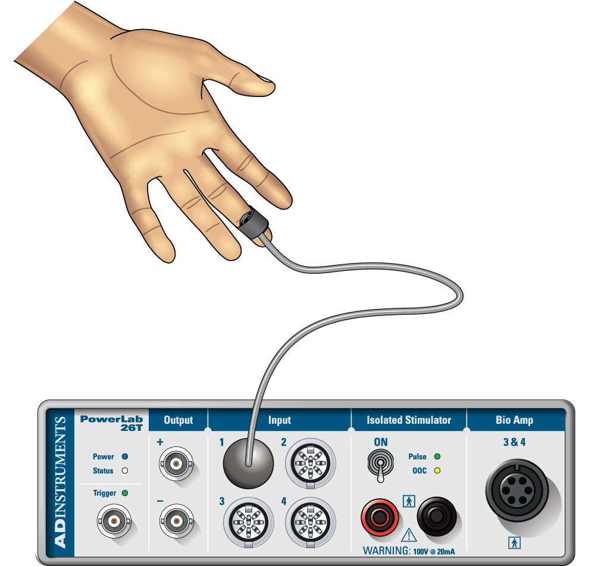
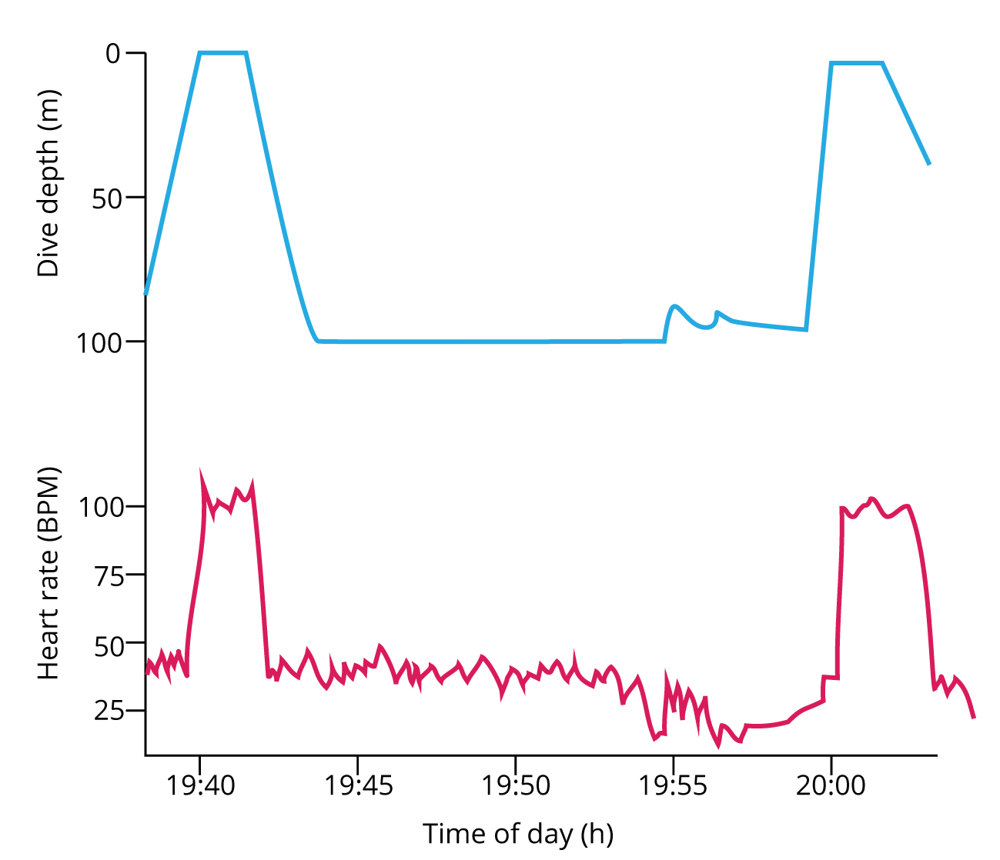
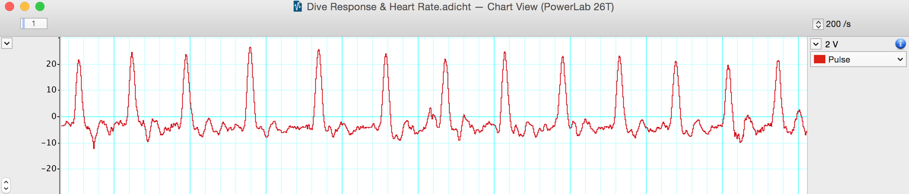
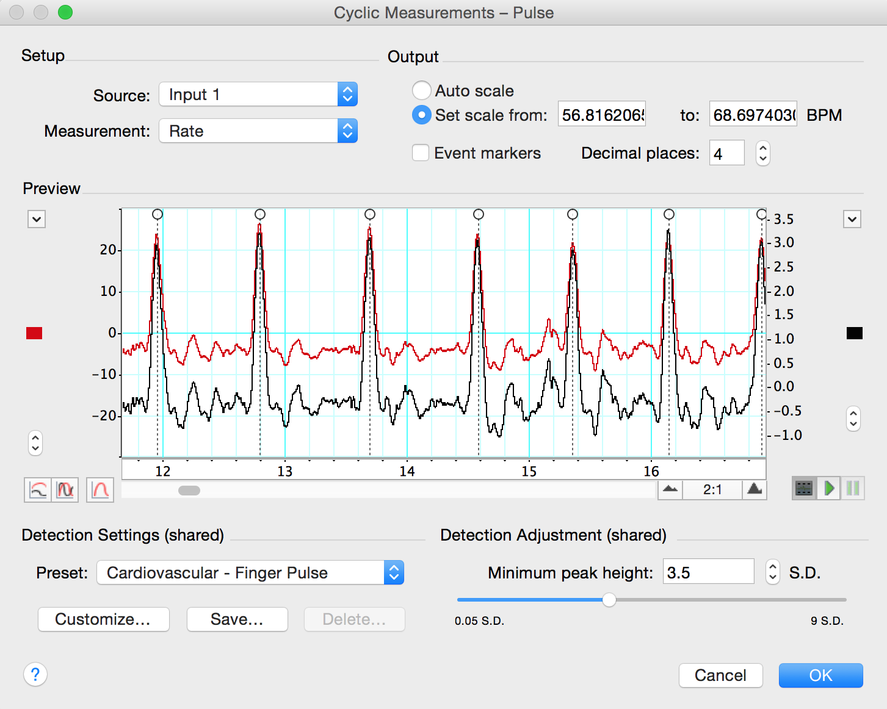
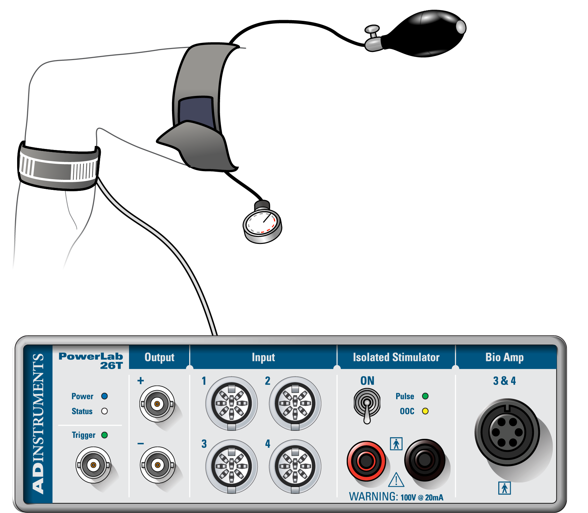
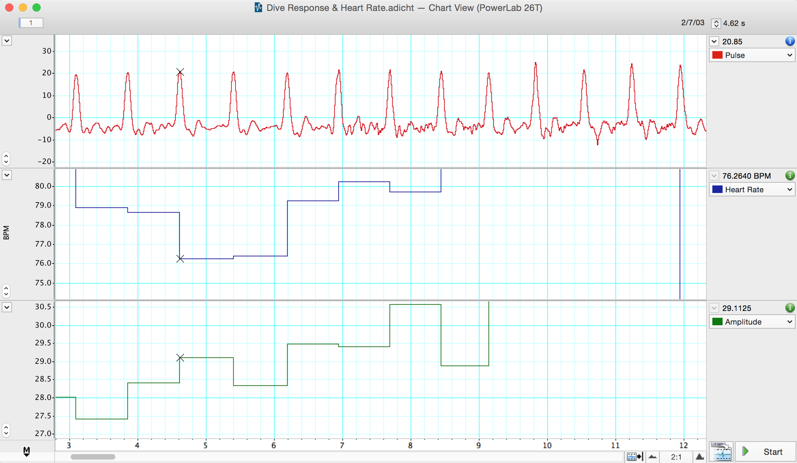
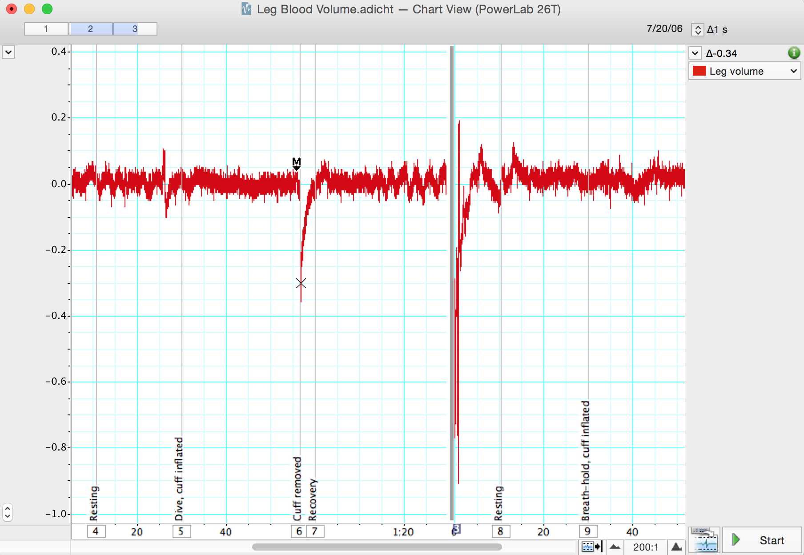

# Quicklinks

You can view and download the [lab notebook here](./DiveResponse_notebook.md). 

- [Background](#background)
- [Required Equipment](#required-equipment)
- [Procedure](#procedure)
    - [Volunteer selection](#volunteer-selection)
    - [Equipment Setup](#equipment-setup)
    - [Exercise 1: Change in Heart Rate during the Dive Response](#exercise-1-change-in-heart-rate-during-the-dive-response)
    - [Exercise 2: Change in Heart Rate during Breath-holding](#exercise-2-change-in-heart-rate-during-breath-holding)
    - [Exercise 3: Change in Peripheral Circulation during the Dive Response](#exercise-3-change-in-peripheral-circulation-during-the-dive-response)
- [Analysis](#analysis)
    - [Exercise 1: Change in Heart Rate during the Dive Response](#exercise-1-change-in-heart-rate-during-the-dive-response-1)
    - [Exercise 2: Change in Heart Rate during Breath-holding](#exercise-2-change-in-heart-rate-during-breath-holding-1)
    - [Exercise 3: Change in Peripheral Circulation during the Dive Response](#exercise-3-change-in-peripheral-circulation-during-the-dive-response-1)

# Dive Response
In this experiment, you will investigate the effects of the dive response on heart rate and peripheral circulation in humans during simulated dives using a Finger Pulse Transducer, Sphygmomanometer, and Respiratory Belt. *Written by staff of ADInstruments with acknowledgment to Dr. Sara Hiebert Burch, Biology Department, Swarthmore College, Swarthmore, Pennsylvania, USA.*

# Background
Many organisms have specific physiological changes when submerged in water; this set of responses is often referred to as the dive reflex or dive response. These vary from organism to organism but usually consist of a *decrease in heart rate and a decrease in blood flow to the extremities*. It appears this reflex is protective for aquatic mammals, helping the animal to conserve oxygen while submerged beneath the surface of the water. Terrestrial animals, however, do not gain an oxygen-conserving benefit from this reflex. In fact, in cold water, oxygen consumption will actually rise as we attempt to produce more heat by shivering. It appears the primary benefit for terrestrial organisms is the reduction of blood flow to the limbs to conserve heat. Water conducts heat away from the body 24 times more efficiently than air. By constricting blood vessels in the limbs, the body is able to maintain a greater percent of its blood in the torso. 

The essential components of the human dive response are the rapid onset of bradycardia, which is defined as a resting heart rate of less than 60 BPM, and peripheral vasoconstriction so that blood is shunted to the torso. This causes an increase in the volume of blood returning to the heart and an increase in stroke volume; it results in a significant increase in arterial blood pressure. To offset the increase, there is a drop in heart rate. 

The dive response is triggered by sudden submergence of the face in cold water, which stimulates the trigeminal nerve receptors around the nose. As water temperature decreases, stimulation of the receptors is enhanced and the severity of the bradycardia increases. Enhanced stimulation of these receptors results in an inhibition of the cardiovascular center, as well as a subsequent reduction in heart rate through both enhanced parasympathetic output and reduced sympathetic output to the heart. Interestingly, initiation of the dive reflex can be used to restore sinus rhythm in patients with paroxysmal supraventricular tachycardia. 

The triggering of this reflex helps to explain the observation that people who are suddenly and rapidly submerged in very cold water for as long as an hour can survive without any long term damage. In contrast, for those who drown in warmer water, suffocation often causes death in only a few minutes. However, there are two consequences of immersing the head in cold water: it is now impossible to breathe and the skin is suddenly cooled. Each of these events may contribute to the circulatory responses seen in the dive response. Breath-holding results in hypoxia and hypercapnia, which in turn affect the cardiovascular system. The circulatory changes observed in individuals holding their breath in air do not closely mimic those of the dive response. 

## Changes in peripheral circulation inferred from venous occlusion plethysmography

A sphygmomanometer cuff (blood pressure cuff) placed around the thigh can be used to block the venous return of blood from the leg. **A pressure of 60 mm Hg suffices to achieve this**. During venous occlusion, blood continues to flow into the leg causing the leg volume to increase slowly. When the cuff is released, venous blood can return to the body and the leg volume decreases rapidly. In this laboratory, we use a respiratory belt transducer placed around the calf to measure the decrease of leg volume. Note that the frequency characteristics of the transducer mean that it cannot measure the slow increase in calf diameter during the period of occlusion (the trace slowly returns to zero). However, the decrease in calf blood volume can be accurately followed by the transducer provided it is fast enough. Simply undoing the thumb valve on the rubber bulb does not always result in a fast enough cuff deflation. **Better results** are obtained by grasping the cuff's Velcro flap or duct tape and unfastening it as rapidly as possible.

# Required Equipment
-   LabChart software
-   PowerLab Data Acquisition Unit
-   Finger Pulse Transducer
-   Sphygmomanometer (Blood Pressure Cuff)
-   Respiratory Belt
-   Wash basin or bucket
-   Cold water
-   Ice
-   Thermometer
-   Medical tape
-   Towel

# Procedure

## Volunteer selection

Choose a group member who:
1. Is comfortable holding their breath for approximately 30 seconds without a stress response or anxiety. 
2. Is wearing shorts or pants of thin tightly-fitting material (like leggings). The final experiment requires wrapping two transducers around the leg, one around the calf and one around the thigh. 

## Equipment Setup

1.  Make sure the PowerLab is turned **off** and the USB cable is connected to the computer.
2.  Connect the Finger Pulse Transducer to Input 1 on the front panel of the PowerLab (Figure 1).
3.  Place the pressure pad of the Finger Pulse Transducer on the tip of the middle finger of either hand of the volunteer. Use the Velcro strap to attach it firmly but without cutting off circulation.

{:width="242" height="229"}
*Figure 1. Equipment Setup for PowerLab 26T*

{:width="16" height="16"} If the strap is too loose, the **signal will be weak**, intermittent, or noisy. If the strap is too tight, blood flow to the finger will be reduced causing a weak signal and discomfort. You may need to adjust the strap in the next stage of the exercise. 

4.  Have the volunteer face away from the monitor and toward the wash basin. Make sure the Finger Pulse Transducer cable can still reach the PowerLab while allowing the volunteer to stand or sit comfortably with his/her face above the water basin. The Finger Pulse Transducer cannot rest on any surface. Turn on the PowerLab. 
    + ***Note:** The Finger Pulse Transducer is very sensitive to movement. The volunteer should keep their hand still when data is being recorded. The volunteer should practice moving their head in-and-out of the basin without moving their hand.*

### Exercise 1: Change in Heart Rate during the Dive Response
In this exercise, you will investigate the changes in heart rate during a simulated dive. An example of a dive response is seen below in Figure 2.

{:width="325" height="280"}
*Figure 2. Elephant Seal Dive Response*

1.  Launch LabChart and open the settings file "Dive Response Settings"
from the **Experiments** tab in the **Welcome Center**. It will be located in the folder for the Dive Response experiment.
1.  Fill the wash basin with cold water, approximately 10-15 °C/50-60F. Use ice and the thermometer to chill and monitor the water. Keep the temperature consistent throughout the experiment. 
    + {:width="16"     height="16"} *Place the basin in an area away from the equipment, and make sure that as the volunteer's face is immersed there is no water splash.*
2.  Have the volunteer positioned in front of the basin, either standing or sitting. Remind the volunteer to keep the hand with the transducer attached still.
1.  Have the volunteer lean over the basin and remain motionless. The volunteer's face should be just above the water's surface. **Start** recording, and immediately add a **comment** with "resting." Record for 15 seconds.
1.  Have the volunteer take a deep breath, exhale partially, and then hold his/her breath while immersing his/her face up to the cheeks in the basin of water. Add a **comment** with "dive." Record data for 30 seconds while the volunteer is submerged. 
    + ***Note:** One group member can tap the volunteer on the back at 10-second intervals to help the volunteer keep track of time and prevent anxiety. The volunteer can come up with any system that will make him/her feel comfortable.* {:width="16"     height="16"} *Do not force the volunteer to remain submerged if he/she is not comfortable!*
2.  After 30 seconds, tell the volunteer to surface to the same position as before the dive. Add a **comment** with "recovery." **Make sure the volunteer remains still**. Record for 30 seconds.
1.  If you can not see a clear pulse waveform (Figure 3), use the channel **AutoScale** button to alter the vertical scale of the channel. 

{:width="575"     height="123"} 
*Figure 3. Finger pulse wave form*

2.  If you cannot see any data for "Heart Rate" and "Amplitude," you need to adjust the detection settings. Select **Cyclic Measurements** in the Channel 2 Channel Function pop-up menu for "Heart Rate" and in the Channel 3 Channel Function pop-up menu for "Amplitude." Move the **Detection Adjustment** slider until the event markers (the small white circles) appear over each peak (Figure 4). 

{:width="394"     height="315"}
*Figure 4. Cyclic Measurements Dialog for Channel 2*

1.  **Stop** recording, and save your data. Do not close the file. The volunteer can use the towel to dry off his/her face. The same volunteer needs to complete each exercise so they should stay in the same place.

### Exercise 2: Change in Heart Rate during Breath-holding
In this exercise, you will determine whether or not breath-holding accounts for the results seen in Exercise 1 (as opposed to immersing the face in cold water).
1.  Position the volunteer as before. *The volunteer's face should be just above the water's surface* and the volunteer should remain still.
1.  Start recording, and immediately add a **comment** with "exercise 2,resting." Record for 15 seconds.
1.  Have the volunteer take a deep breath, exhale partially, and then hold his/her breath but remain in the position just above the water. Add a comment with "breath-hold." Record for 30 seconds while the volunteer is breath-holding. ***Note:** If the volunteer is anxious, a similar tapping system as before can be used.*
1.  After 30 seconds, tell the volunteer to resume breathing. Add a **comment** with "normal breathing." Make sure the volunteer remains still. **Stop** recording after 30 seconds. Save your data.

### Exercise 3: Change in Peripheral Circulation during the Dive Response
In this exercise, you will examine the effects of a dive simulation on peripheral circulation. You will use a Sphygmomanometer and Blood Pressure Cuff placed around the thigh to occlude the venous return of blood from the leg and measure changes in leg blood volume with a Respiratory Belt. During venous occlusion, blood continues to flow into the leg causing the blood volume to increase slowly. When the cuff is released, venous blood can return to the body and the leg blood volume decreases rapidly.
1.  Remove the Finger Pulse Transducer and connect the Respiratory Belt to Input 1 on the front of the PowerLab (Figure 6). The hardware needs to be connected before you open the settings file.

{:width="312" height="272"}
*Figure 6. Equipment Setup for PowerLab 26T.*

2.  Attach the Respiratory Belt around the volunteer's calf with the writing facing outward. It can be worn over thin pants or tightly-fitting clothing; if the volunteer is wearing heavy or baggy clothing, it needs to be removed. Refer to Figure 6 for proper placement.

3.  Place a deflated Blood Pressure Cuff of the Sphygmomanometer around the volunteer's thigh (Figure 5). Supplement the Velcro fastening with medical tape, if necessary.
1.  Practice inflating and rapidly deflating the Blood Pressure Cuff as follows: inflate the cuff rapidly to 60 mmHg, maintain the pressure for 30 seconds, and grasp the Velcro flap or medical tape and unfasten it releasing the pressure as quickly as possible. Be sure to fully deflate the cuff before reattaching it. 
1.  Open the settings file "Dive Blood Volume Settings" from the **Experiments** tab in the **Welcome Center**. It will be located in the folder for this experiment. Make sure the data from Exercise 2 has been saved.
1.  Refill the wash basin with cold water the same temperature as before (or add ice), and place the basin in front of the volunteer. Have the volunteer lean over the basin and remain motionless. The volunteer's face should be just above the water's surface.
1.  **Start** recording, and immediately add a **comment** with "resting, control." Record for 10 seconds.
1.  Inflate the Blood Pressure Cuff rapidly to 60 mmHg, and maintain this pressure for 30 seconds. Add a **comment** with "cuff inflated."
1.  Prepare a comment with "cuff removed." Grasp the Velcro flap or duct tape and unfasten it so the pressure is released quickly; immediately add the **comment**. Record for ten more seconds then **Stop** recording.
1.  Release the pressure valve on the rubber bulb and squeeze out all the air from the cuff before putting it on again. Put on the cuff in the same place. Once the cuff is reattached, have the volunteer return to the starting position above the wash basin.
1.  **Start** recording, and immediately add a **comment** with "resting, dive." Record for 10 seconds, and inflate the cuff rapidly to 60 mmHg. Add a **comment** with "cuff inflated."
1.  Have the volunteer take a deep breath, exhale partially, and then hold his/her breath while immersing his/her face up to the cheeks in the basin of water. Add a **comment** with "dive."
1.  Prepare a **comment** with "cuff removed". Twenty seconds into the dive, rapidly remove the cuff as practiced. Immediately add the **comment**. Record for a further 10 seconds then have the volunteer lift his/her face out of the water to the starting position and breathe normally. Record for 10 more seconds. **Stop** recording and save your data. The volunteer's face can be dried with the towel.
1.  Release the pressure valve on the rubber bulb and squeeze out all the air from the cuff before putting it on again. Put on the cuff in the same place. Once the cuff is reattached, have the volunteer return to the starting position, face just above the water's surface, remaining still.
1.  **Start** recording, and immediately add a **comment** with "resting." Record for 10 seconds and inflate the cuff rapidly to 60 mmHg.
1.  Have the volunteer take a deep breath, exhale partially, and then hold his/her breath but remain in the position just above the water. Add a **comment** with "breath-hold, cuff inflated."
1.  Prepare a **comment** with "cuff removed." Twenty seconds into the breath-hold rapidly remove the cuff as practiced. Immediately add the **comment**. Record for a further 10 seconds. Tell the volunteer to resume breathing normally. Add a **comment** with "normal breathing." Record for 10 more seconds. **Stop** recording and save your data. 

## Analysis

### Exercise 1: Change in Heart Rate during the Dive Response
1.  Examine the data in the Chart View and **Autoscale**, if necessary. Use the **View Buttons** to change the compression of the data trace so the entire exercise can be viewed at once. Identify the rest section of the data, then zoom in to find a representative cycle. You can change the compression and scale as often as required.
1.  Move the **Waveform Cursor** to the representative cycle during rest. Look at the data traces for "Heart Rate" and "Amplitude" (Figure 5), and record the values corresponding to the pulse peak. 

{:width="476"     height="277"}
*Figure 5. Sample Data and Analysis*

1.  Repeat step 2 for the following conditions:
    -   15 seconds into the dive
    -   Just before the end of the dive
    -   30 seconds after the end of the dive (recovery)
2.  Enter these values in Table 1 of the [Lab Notebook](/Labs/ADInstrumentsLabs/DiveResponse/DiveResponse_notebook.md).

### Exercise 2: Change in Heart Rate during Breath-holding 
1.  Examine the data in the Chart View and **Autoscale**, if necessary. Use the **View Buttons** to change the compression of the data trace as in the Analysis for Exercise 1, if necessary.
1.  Move the **Waveform Cursor** to a representative cycle during rest. Look at the data traces for "Heart Rate" and "Amplitude," and record the values corresponding to the pulse peak.
1.  Repeat step 2 for the following conditions:
    -   15 seconds into the breath-hold
    -   Just before the end of the breath-hold
    -   30 seconds after the end of the breath-hold (recovery)
2.  Enter these values in Table 2 of the Lab Notebook.
   
### Exercise 3: Change in Peripheral Circulation during the Dive Response
1.  Examine the data in the Chart View and **Autoscale**, if necessary. Use the **View Buttons** to change the compression of the data trace so the entire exercise can be viewed at once. Identify the rest section of the data and change the compression to find the point where the cuff is ripped off the leg.
1.  Drag the **Marker** to the point where the cuff is ripped off the leg during rest. Place the **Waveform Cursor** at the lowest point following cuff removal (Figure 6). The amplitude display will tell you the change in leg blood volume.
1.  Repeat step 2 for the following conditions:
    -   During the dive
    -   During the breath-hold
2.  Enter these values in Table 3 of the Lab Notebook.

{:width="460" height="318"}
*Figure 7. Analysis for Leg Blood Volume*

