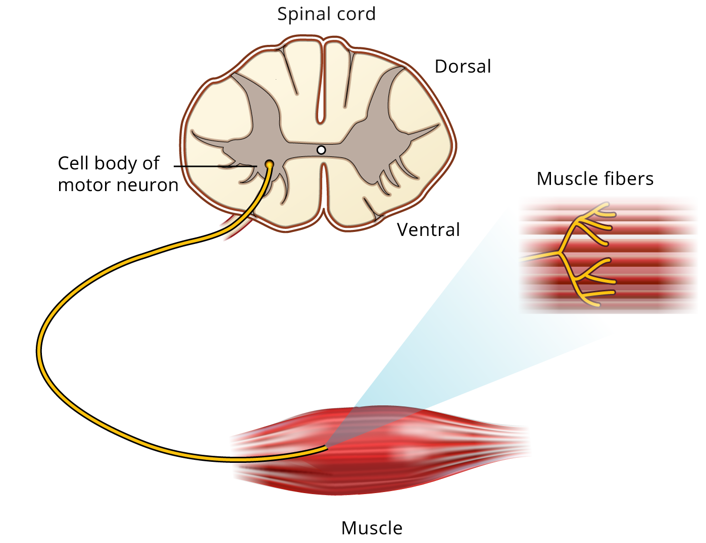
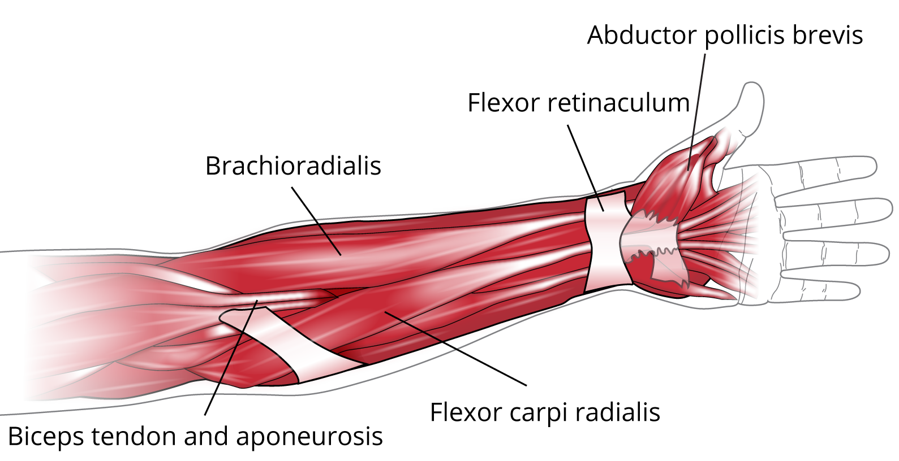
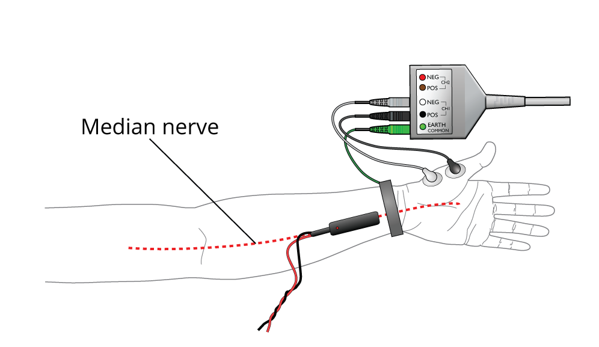
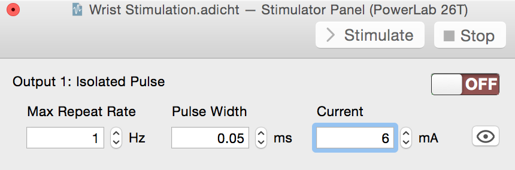

**Electromyography**

# In this experiment, you will explore the electrical activity of skeletal muscle for both voluntary and evoked muscle actions and will learn how to record an electromyogram, or EMG. From the data, you will attempt to measure nerve conduction velocity.

# *Written by staff of ADInstruments.*

# Background

Nerve and muscle disorders cause the muscles to react in abnormal ways.
Measuring the electrical activity in muscles and nerves can help detect
the presence, location and extent of diseases that damage muscle tissue
(such as muscular dystrophy) or nerves (such as amyotrophic lateral
sclerosis: Lou Gehrig\'s disease). In the case of nerve injury, the
actual site of nerve damage can often be located.

{:width="443"
height="205"}Skeletal muscles do the majority of the
work for locomotion and support of the animal skeleton. The skeletal
muscles produce movement, maintain posture, and assist with body
temperature maintenance, among other actions. Skeletal (striated)
muscles attach to the skeleton by tendons (strong bundles of collagen
fibers), aponeuroses (flat, sheet like tendons) and fascia (bands of
connective tissue). Each muscle is made up of individual muscle fibers
organized in fascicles (Figure 1).

*Figure 1. Skeletal muscle structure*

A typical skeletal muscle contains thousands of muscle fibers. Each
individual fiber is innervated by a branch of a motor axon. Under normal
circumstances, a neuronal action potential activates all of the muscle
fibers innervated by the motor neuron and its axonal branches. The motor
neuron, together with all of the individual muscle fibers that it
innervates, is termed a motor unit (Figure 2). This activation process
involves (1) the initiation of an action potential, either voluntarily
or as a result of electrical stimulation of a peripheral nerve, (2)
conduction of the action potential along the nerve fiber, (3) release of
neurotransmitter at the neuromuscular junction, and (4) depolarization
of the muscle membrane with resultant contraction of the muscle fibers.

*Figure 2. The components of a motor unit*

{:width="387"
height="298"}During a contraction, there is synchronous
activity in a number of fibers in the same muscle. The electrical signal
recorded from a contracting muscle is called an electromyogram, or EMG.
The EMG provides a depiction of the timing and pattern of muscle
activity during complex movements. The raw surface EMG signal reflects
the electrical activity of the muscle fibers active at that time.

Motor units fire asynchronously and it is sometimes possible, with
exceedingly weak contractions, to detect the contributions of individual
motor units to the EMG signal. As the strength of the muscular
contraction increases, however, the density of action potentials
increases and the raw signal at any time may represent the electrical
activity of perhaps thousands of individual fibers.

The raw EMG signal during voluntary contractions may be processed in
various ways to indicate the intensity of EMG activity. In the method
used here, known as the root mean square (RMS), the negative-going
portions of the EMG are inverted by squaring the whole signal, and then
the whole signal is averaged and the square root calculated. This
process smoothes out individual spikes and makes the time course of
changing activity much clearer.

In this experiment you will examine coactivation, a phenomenon in which
contraction of a muscle leads to more minor activity in the antagonist
muscle. The physiological significance of this is not entirely clear,
but it has been suggested that it helps to stabilize the joint.

You will also record EMG signals produced by electrical stimulation of a
motor nerve supplying a muscle. The abductor pollicis brevis muscle is
one of the intrinsic muscles of the hand, more specifically an intrinsic
muscle of the thumb, on the palmar surface of the hand. The motor nerve
to this muscle, which is the median nerve, is simple to stimulate at the
wrist and elbow. When brief electrical pulses are administered through
the skin to the nerve, the time it takes for the muscle to contract in
response to the electrical pulse is recorded. The speed of the response
is dependent on the conduction velocity. In general, the range of normal
conduction velocities will be approximately 50 to 60 meters per second,
however, the normal conduction velocity may vary from one individual to
another and from one nerve to another. In a clinical setting, EMG and
nerve conduction studies are usually conducted together.

# Required Equipment

-   LabChart software

-   PowerLab Data Acquisition Unit

-   5 Lead Shielded Bio Amp Cable

-   Shielded Lead Wires (5 Snap-on)

-   Dry Earth Strap

-   Disposable ECG Electrodes

-   Stimulating Bar Electrode

-   Electrode Cream or Paste

-   Abrasive Gel or Pad

-   Alcohol Swabs

-   Gauze or cotton ball (or similar material)

-   Ballpoint pen

-   Scissors

-   Four books or objects of similar weight (about 1 kg/2.2 lbs each)

# Procedure

### Equipment Setup and Electrode Attachment

1.  Make sure the PowerLab is turned **off** and the USB cable is
    connected to the computer.

2.  Connect the 5 Lead Shielded Bio Amp Cable to the Bio Amp Connector
    on the front panel of the PowerLab (Figure 3). The hardware needs to
    be connected **before** you open the settings file.

3.  Remove any jewelry from the volunteer's hand and arm. Use the
    ballpoint pen to mark two small crosses 2-3 cm apart on the skin
    above the biceps muscle and triceps muscle. Use Figures 3 and 4 as a
    guide. Abrade the skin with abrasive gel or alcohol pad. This is
    important as abrasion helps reduce the skin's resistance. After
    abrasion, clean the area with an alcohol pad to remove the dead skin
    cells.

-   {:width="321"
    height="255"}***Note:** There is a video in the
    Multimedia folder illustrating this setup if you have further
    questions.*

    *Figure 3. Equipment Setup for PowerLab 26T*

4.  While the skin is drying, attach the Shielded Lead Wires to the Bio
    Amp Cable. Attach the Disposable Electrodes to the end of the
    Channel 1, Channel 2, and earth wires. Follow the color scheme on
    the Bio Amp Cable.

5.  Attach the four electrodes and Dry Earth Strap (Earth lead) to the
    volunteer. Channel 1 will lead to the biceps (place the negative
    \[white\] wire 2-3 cm above the positive \[black\] wire), Channel 2
    will lead to the triceps (place the negative \[red\] wire 2-3 cm
    above the positive \[brown\] wire), and the Earth (green) will be
    connected to the Dry Earth Strap. Refer to Figures 3 and 4 for
    proper placement.

    {:width="337"
    height="235"}

*Figure 4. Skeletal muscle structure*

6.  Check that all four electrodes and the Dry Earth Strap (Earth lead)
    are properly connected to the volunteer and the Bio Amp Cable before
    proceeding. Turn on the PowerLab.

### Exercise 1: Voluntary Change in Contractile Force

In this exercise, you will examine changes in voluntary muscle
contraction and how contractile force changes with increasing demand.

1.  Launch LabChart and open the settings file "Voluntary Change
    Settings" from the **Experiments** tab in the **Welcome Center**. It
    will be located in the folder for this experiment.

    ***Note:** Channels 1 and 2 are the RMS activity of the biceps and
    triceps muscles. RMS activity is commonly used in the assessment of
    muscle function because it is easier to quantify. Use these two
    channels when completing your analysis.*

<!-- -->

2.  Have the volunteer sit in a relaxed position with his/her elbow bent
    90^o^ and palm facing upward. Make sure the volunteer's elbow is not
    on the table. The volunteer's other hand should grasp the wrist of
    the recorded arm. Make sure the volunteer is facing away from the
    monitor.

<!-- -->

6.  Select **Bio Amp** from the Channel 3 Channel Function pop-up menu.
    Have the volunteer make a strong contraction of the biceps muscle.
    This is done by bending the recorded arm further while resisting
    this movement with the other arm. Observe the signal and adjust the
    range in the dialog so that the maximal electrical response occupies
    about one half to two-thirds of the full scale. Click OK.

7.  Repeat step 3 for the triceps signal in Channel 4. A strong
    contraction of the triceps muscle is made by trying to straighten
    the recorded arm while resisting this movement with the other arm.

8.  **Start** recording. Add a **comment** with the volunteer's name.
    Have the volunteer make a strong contraction of the biceps and then
    the triceps. Add a **comment** at the start of each contraction.
    **Stop** recording.

9.  Have the volunteer return to his/her original relaxed position.
    **Start** recording. The blue line in Chart View will help you
    indicate the change in procedure.

10. Prepare a comment with "one book." After a few seconds, add the
    **comment** and place one book on the hand of the subject. Leave it
    on for three seconds and remove it. Repeat this process with two
    books, then three, and then four books to give a series of
    increasing weights. Add a **comment** each time you add books.
    **Save your data**. Leave the disposable electrodes and lead wires
    in place; they are used in Exercise 2.

# Analysis

### Exercise 1: Voluntary Change in Contractile Force

1.  Examine the data in the Chart View. **Autoscale,** if necessary.
    Note the changes in activity in the "Biceps" channel. Note also that
    placing weights on the hand gives rise to little or no activity in
    the triceps muscle.

2.  {:width="492"
    height="293"}Select a small part of the "Biceps"
    activity and examine it in **Zoom View**. The raw EMG signal is
    composed of many up-and-down spikes (Figure 5).

*Figure 5 Raw EMG Signal*

3.  Note the relationship between the "Biceps" channel and the "RMS
    Biceps" channel. The height of the RMS trace reflects the overall
    activity of the raw EMG signal and gives a simpler view of the
    muscle's electrical activity. Note the changes in the RMS trace as
    books were added and removed.

4.  Select data points from "RMS Biceps" when books were added. Enter
    these values in Table 1 of the Data Notebook on page 12 of this
    document. The height of the trace correlates with the force produced
    by the muscle.

### Exercise 2: Alternating Activity and Coactivation

In this exercise, you will examine the activity of antagonist muscles
and the phenomenon of coactivation.

1.  Click the "Home" button on the lower left corner of the screen. Open
    the settings file "Coactivation Settings" from the **Experiments**
    tab in the **Welcome Center**. It will be located in the folder for
    this experiment. Make sure the data from Exercise 1 is saved.

2.  Have the volunteer sit in a relaxed position with his/her elbow bent
    90^o^ and palm facing upward. Make sure the elbow is not on the
    table. The volunteer's other hand should grasp the wrist of the
    recorded arm. Make sure the volunteer is facing away from the
    monitor.

3.  Have the volunteer practice activating the biceps and triceps
    immediately after one another. The volunteer should practice this
    until it feels like both muscles are being equally activated in
    turn. Pause shortly after each activation; this makes the data
    clearer.

4.  **Start** recording. Add a **comment** with the volunteer's name,
    and record baseline EMG for 30 seconds.

5.  Add a **comment** with "activation," and have the volunteer use the
    alternating pattern of activation for 30 seconds. **Save your data
    when you are finished recording**. [Read "Exercise 3 Equipment
    Setup" before disconnecting electrodes and lead wires.]{.underline}

# Analysis

### Exercise 2: Alternating Activity and Coactivation

1.  Examine the data in the Chart View for both the biceps and triceps,
    and **Autoscale**, if necessary. Note the large-scale alternation of
    activity.

2.  Note when the biceps muscle is activated forcefully; there is a
    minor increase in the activity of the triceps. Correspondingly,
    there is a minor increase of activity in the biceps trace when the
    triceps are activated. This phenomenon is coactivation. Its
    physiological meaning is not well understood, but it is thought to
    stabilize the elbow joint.

3.  Select data points from the RMS EMG peaks for both muscles during
    contraction of the biceps and contraction of the triceps. Enter
    these values in Table 2 of the Data Notebook on page 12 of this
    document.

### Section 2: Evoked EMG Activity

In these exercises, you will electrically stimulate the volunteer's
median nerve at the wrist and elbow to measure nerve conduction
velocity.

### Equipment Setup

{:width="15"
height="15"} **Exercises 3 and 4 involves application
of electrical shocks to muscle through electrodes placed on the skin.
Students who have cardiac pacemakers or who suffer from neurological or
cardiac disorders should not volunteer for these exercises. If the
volunteer feels major discomfort, discontinue the exercise and consult
your instructor.**

1.  Leave the Shielded Bio Amp Cable attached to the PowerLab. Remove
    the Channel 2 Lead Wires from the Cable and detach the Channel 1
    Lead Wires from the Disposable Electrodes, leaving the wires
    connected to the Bio Amp Cable.

2.  Use the ballpoint pen to mark two small crosses 2-3 cm apart on the
    skin above the abductor pollicis brevis muscle. Use Figures 6 and 7
    as a guide. Abrade the skin with abrasive gel or pad. After
    abrasion, clean the area with an alcohol swab to remove the dead
    skin cells. Trim the Disposable Electrodes (If the volunteer has
    small hands) to match those in Figure 7 and stick them to the skin,
    ensuring the negative (white) electrode is closer to the wrist.
    Attach the Earth wire lead to the dry earth strap and secure around
    the volunteers wrist. Alternately you may use another disposable
    electrode attached to the volunteer at the wrist or back of the
    hand.

-   {:width="418"
    height="214"} ***Note:** There is a video in the
    Multimedia folder illustrating this setup if you have further
    questions.*

### 

*Figure 6. Some Muscles of the Forearm and Hand*

### {:width="441" height="256"}

*Figure 7. Evoked EMG Setup at the Wrist*

3.  Connect the Stimulating Electrode to the Isolated Stimulator output
    of the PowerLab. Make sure the red (positive) connector is in the
    red output and the black (negative) connector is in the black
    output.

4.  Place a small amount of Electrode Cream or Electrode paste on the
    two silver pads of the Stimulating Bar Electrode and place it over
    the volunteer's median nerve at the wrist (Figure XX). The
    Stimulating Bar Electrode should lie along the long axis of the arm,
    with the leads pointing toward the hand; the wires pointing toward
    the inner elbow -- a red (positive) dot on the back of the bar
    should be placed away from the hand.

5.  Have the volunteer hold the electrode in place with the opposite
    hand.

### Exercise 3: Finding the median nerve

Due to anatomical differences, the exact spot for the most efficient
stimulation of the Median nerve will vary between volunteers. In the
first part of this exercise, you will find the "sweet spot" for the
volunteer before recording the EMG activity.

Muscular responses will be observed by watching the hand of the
volunteer. Some motor effects that may be observed include:

-   Movement of the thumb towards the fingers (due to stimulation of
    adductor pollicis and flexor muscles of the thumb)

-   Bending of the wrist (due to the flexor carpi radialis and flexor
    carpi ulnaris muscles)

-   Bending of the last segments of the fingers (due to the long finger
    flexor muscles)

-   Movement of all fingers, combined with the pulling of the thumb
    towards the index finger (due to the intrinsic muscles of the hand
    innervated by the ulnar nerve)

-   Lifting of the thumb (due to stimulation of abductor pollicis at the
    base of the thumb innervated by the median nerve)

1.  Launch LabChart and open the settings file "Nerve Effect Settings"
    from the **Experiments** tab in the **Welcome Center**. It will be
    located in the folder for this experiment.

-   ***Note:** No data will be recorded in this file. Its purpose is to
    control the Isolated Stimulator.*

2.  {:width="369"
    height="121"}The **Stimulator Panel** should open
    (Figure 8). If it does not, select Stimulator Panel from the
    **Setup** menu.

    *Figure 8. Stimulator Panel*

<!-- -->

11. Have the volunteer sit in a relaxed position. Make sure the
    volunteer is still holding the Stimulating Bar Electrode in place
    over the median nerve.

12. Turn on the Isolated Stimulator by flipping the switch on the
    PowerLab. The Isolated Stimulator only becomes active when the On
    button in the Stimulator Panel is selected.

13. Select the **On** button in the Stimulator Panel. Observe the
    volunteer's hand. Look for the twitch contractions affecting the
    thumb and fingers. Have the volunteer describe the effects he/she is
    experiencing.

14. Make small adjustments by moving the bar around the wrist and
    examine the effect. Locate the position giving the largest twitches.
    You can turn the isolated stimulator off at any time by selecting
    the **off** button in the Stimulator Panel. When the volunteer feels
    a slight tingle in the thumb, they are in the right area for the
    next part of the exercise.

-   ***Note:** If nothing happens, you may need to increase the stimulus
    amplitude (current) to observe a twitch. Increase the amplitude in
    the Stimulator Panel Start at 6 mA and increase to 12 mA in 1 mA
    increments if necessary.*

-   ***Alternately:** No response may be due to a bad connection between
    the bar electrodes and the volunteer. If the yellow OOC (Out of
    Compliance) LED is blinking with each stimulus, this is likely the
    case. Turn off the stimulator and clean the stimulating bar and the
    volunteer's arm with alcohol wipes. Reapply conductive cream to the
    electrodes and continue with the exercise.*

15. Explore the results of stimulating at other places in the forearm.
    Have the volunteer describe the effects he/she is experiencing. Each
    time you move the electrode to another location wipe away the
    residual Electrode Cream from the skin with an alcohol wipe to
    prevent short-circuiting. Remember the two pads need to be aligned
    along the arm's length.

-   {:width="415"
    height="190"}***Note:** Some volunteers may fail to
    show any thumb twitch response stimulating the median nerve. In some
    people, the abductor pollicis brevis muscle is innervated by the
    ulnar nerve instead of the median nerve. This is an example of
    anatomical variation. Try moving the Stimulating Bar Electrode to
    the ulnar nerve (see figure 9).*

*Figure 9. Position of the Median and Ulnar Nerves*

8.  Stimulate the ulnar nerve at the level of the elbow. The nerve
    passes behind a bony prominence called the medial epicondyle on the
    humerus. At this location, the nerve is exposed to minor mechanical
    injury and is known to children as the "funny bone." Stimulation at
    this site gives large and obvious motor effects.

-   ***Note:** Stimulation in most places should give minimal
    discomfort. In some locations on some volunteers, there is
    substantial sensory effect. There may be painful sensation in the
    forearm or hand away from the site of stimulation toward the
    fingers. At these locations, a cutaneous sensory nerve is being
    stimulated.*

9.  When you have observed a good thumb twitch reaction, select the
    **Off** button in the Stimulator Panel to stop the stimulator. You
    do not need to save your data as nothing was recorded.

### Exercise 4: Evoked EMG Activity

1.  Open the Welcome center by clicking the Home button on the lower
    left corner of the screen. Open the settings file "Evoked EMG
    Settings" from the **Experiments** tab in the **Welcome Center**. It
    will be located in the folder for this experiment.

2.  Have the volunteer return the simulating bar electrode to the spot
    on the wrist that gave a good thumb twitch response. Have the
    volunteer apply pressure to the Bar Electrode to make sure the nerve
    is stimulated and the electrode does not move. The volunteer must
    keep holding the electrode throughout this exercise.

3.  Make sure the volunteer is facing away from the monitor, and
    **Start.** LabChart will record a single block of 0.05 seconds. The
    stimulator panel will be preset to Current to 6.0 mA. Add a
    **comment** with the volunteer's name and "wrist" to denote the area
    being stimulated.

4.  Increase the Current to 8.0 mA. Click **Start** to apply the
    stimulus. If a response is not recorded, have the volunteer move the
    electrode to a different spot on the nerve (Figure 9) and apply
    pressure. If the volunteer does not feel the stimulus, increase the
    stimulus amplitude by 2 mA each time (up to 20 mA). The lights next
    to the switch on the PowerLab will light up when a stimulus is made.

5.  Once you record an evoked EMG response, increase the amplitude by 2
    mA and click **Start** again. Continue increasing the amplitude by 2
    mA until you reach 20 mA or the volunteer requests you to stop. Add
    a **comment** with the amplitude each time you begin recording.

-   ***Note:** The evoked response should increase with increasing
    stimuli until a maximal response is reached, after which increasing
    the stimulus does not further increase the response amplitude.*

6.  {:width="361"
    height="213"}Move the Stimulating Bar Electrode
    over the median nerve at the elbow. Refer to Figure 10 for proper
    placement. Mark the spot in between the pressure imprints on the
    skin. Everything else will remain the same.

*Figure 10. Evoked EMG Setup at the Elbow*

7.  Turn on the Isolated Stimulator and return the amplitude to 6 mA.
    Repeat steps 3-4.

8.  Once you have found a response, increase the amplitude to maximum
    amplitude used at the wrist. This should be 18 to 20 mA. Add a
    **comment** with the amplitude used when you start recording. Record
    three responses at this amplitude.

9.  Turn off the Isolated Stimulator. Mark the spot in between the
    pressure imprints on the skin and disconnect the equipment from the
    volunteer. **Save your data.**

# Analysis

### Exercise 4: Evoked EMG Activity

1.  Examine the data in the Scope View for the evoked response of the
    wrist and elbow at maximum amplitude.

2.  Use **Zoom View** to measure the latency of a single waveform for
    each type of response (wrist and elbow). Latency is the time elapsed
    from the start of the stimulus (the start of each record) to the
    start of the evoked response. Record these values in Table 3 of the
    Data Notebook under "Latency" on page 12 of this document. In
    addition, calculate the difference between the two latencies and
    enter the value in Table 3.

-   ***Note:** You may see a very early deflection in response. This is
    a stimulus artifact and must be ignored when calculating the latency
    (Figure 11).*

3.  Measure and record the distance between the marks at the wrist and
    elbow and record it in Table 3 of the Data Notebook under "Distance"
    on page 12 of this document. This is the distance between
    stimulation sites.

4.  Using the conduction velocity equation given below, calculate the
    nerve conduction velocity of the volunteer. Enter the velocity under
    Table 3 of the Data Notebook on page 12.

    

{:width="262"
height="187"}{:width="277"
height="187"}

*Figure 11. Evoked EMG from wrist (right) and elbow (left). Arrow
denotes a stimulus artifact*

5.  Record the nerve conduction velocity from at least four other groups
    in Table 4 of the Data Notebook on page 12. You will need this data
    to complete the laboratory report.

    **Data Notebook**

#### Table 1. Force Produced by Adding Books

<table>
<colgroup>
<col style="width: 45%" />
<col style="width: 54%" />
</colgroup>
<thead>
<tr>
<th style="text-align: center;"></th>
<th style="text-align: center;">
<strong>RMS Biceps
Amplitude</strong>

<strong>(mV.s)</strong>
</th>
</tr>
</thead>
<tbody>
<tr>
<td style="text-align: center;"><strong>One Book</strong></td>
<td></td>
</tr>
<tr>
<td style="text-align: center;"><strong>Two Books</strong></td>
<td></td>
</tr>
<tr>
<td style="text-align: center;"><strong>Three Books</strong></td>
<td></td>
</tr>
<tr>
<td style="text-align: center;"><strong>Four Books</strong></td>
<td></td>
</tr>
</tbody>
</table>

#### Table 2. Coactivation

<table>
<colgroup>
<col style="width: 31%" />
<col style="width: 34%" />
<col style="width: 34%" />
</colgroup>
<thead>
<tr>
<th style="text-align: center;"></th>
<th style="text-align: center;">
<strong>RMS Biceps
Amplitude</strong>

<strong>(mV.s)</strong>
</th>
<th style="text-align: center;">
<strong>RMS Triceps
Amplitude</strong>

<strong>(mV.s)</strong>
</th>
</tr>
</thead>
<tbody>
<tr>
<td><strong>Biceps Contracting</strong></td>
<td></td>
<td></td>
</tr>
<tr>
<td><strong>Triceps Contracting</strong></td>
<td></td>
<td></td>
</tr>
</tbody>
</table>

#### Table 3. Evoked EMG

<table>
<colgroup>
<col style="width: 50%" />
<col style="width: 49%" />
</colgroup>
<thead>
<tr>
<th><h4 id="stimulus-location">Stimulus Location</h4></th>
<th style="text-align: center;"><strong>Latency (ms)</strong></th>
</tr>
</thead>
<tbody>
<tr>
<td><h4 id="wrist">Wrist</h4></td>
<td style="text-align: center;"></td>
</tr>
<tr>
<td><h4 id="elbow">Elbow</h4></td>
<td style="text-align: center;"></td>
</tr>
<tr>
<td><h4 id="difference">Difference</h4></td>
<td style="text-align: center;"></td>
</tr>
<tr>
<td>
<strong>Distance Between</strong>

<strong>Stimulation Sites (mm)</strong>
</td>
<td style="text-align: center;"><h4 id="section-2"> </h4></td>
</tr>
</tbody>
</table>

**Table 4. Nerve Conduction Velocity**

| **Group** | **Nerve Conduction Velocity (m/s)** |
|:---------:|:-----------------------------------:|
|           |                                     |
|           |                                     |
|           |                                     |
|           |                                     |
|           |                                     |

**Study Questions**

1.  **Unlike the discrete waveform from an electrocardiogram, the
    electromyogram waveform is irregular. Why do you suppose this is?**

2.  **What happened to the biceps EMG trace when you added weights to
    your arm? Was this expected?**

3.  **Explain the phenomenon of coactivation in your own words.**

4.  **What happened to the triceps EMG trace when the biceps was
    activated? Does the data support the phenomenon of coactivation?**

5.  **What was the nerve conduction velocity of the volunteer's nerve?
    How does it compare with the nerve conduction velocity of members of
    the other groups?**

6.  **Based on the calculation for nerve conduction velocity, how long
    would it take for a nerve impulse to travel from the spinal cord to
    the big toe? Assume the distance traveled is 1 m and the nerve
    conduction velocity of a large motor fiber is 50 m/s.**

Copyright © 2015 ADInstruments Pty Ltd. All rights reserved.

PowerLab® and LabChart® are registered trademarks of ADInstruments Pty
Ltd. The names of specific recording units, such as PowerLab 8/30, are
trademarks of ADInstruments Pty Ltd. Chart and Scope (application
programs) are trademarks of ADInstruments Pty Ltd.

**www.ADInstruments.com**
