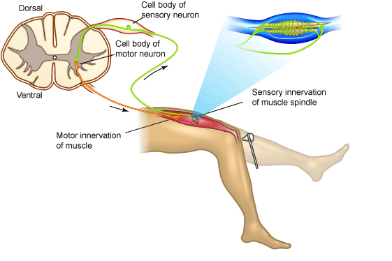
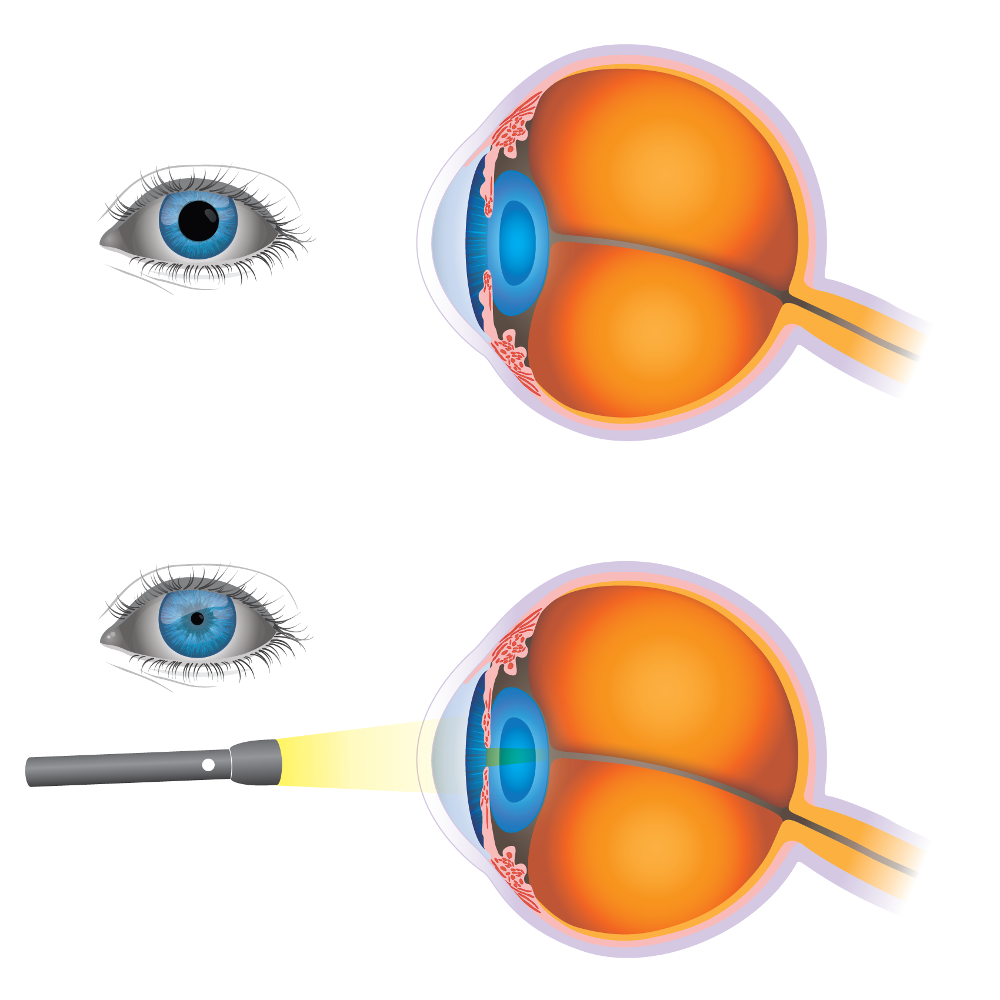
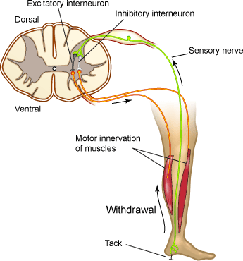
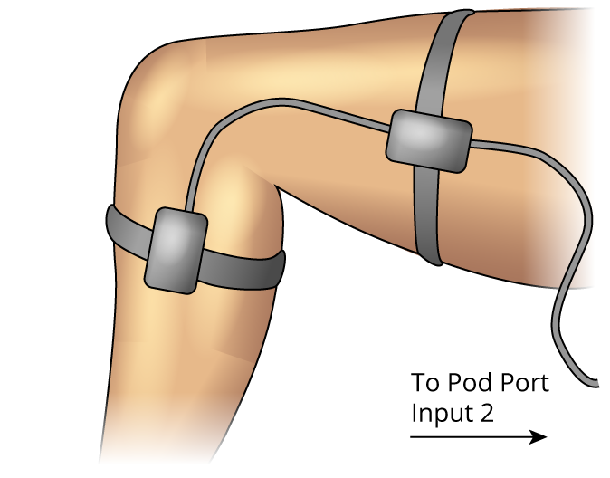
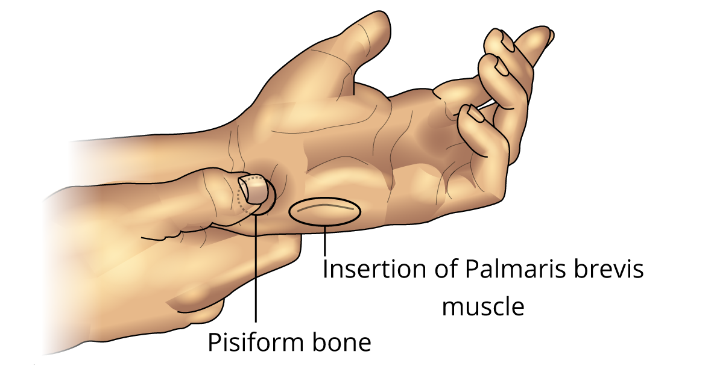
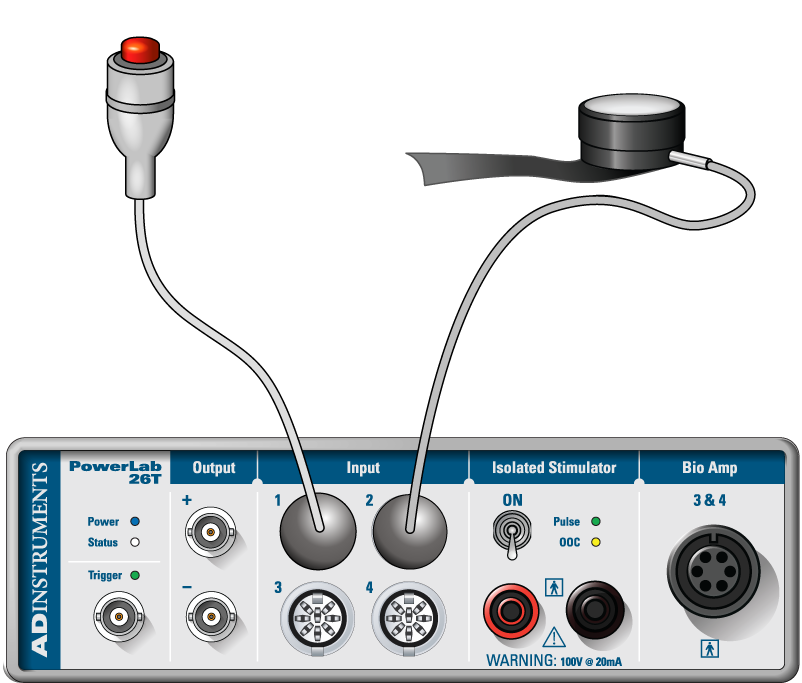
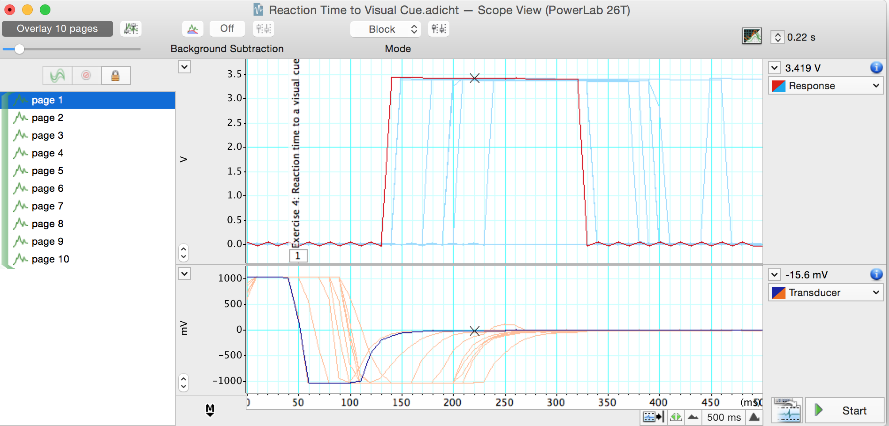
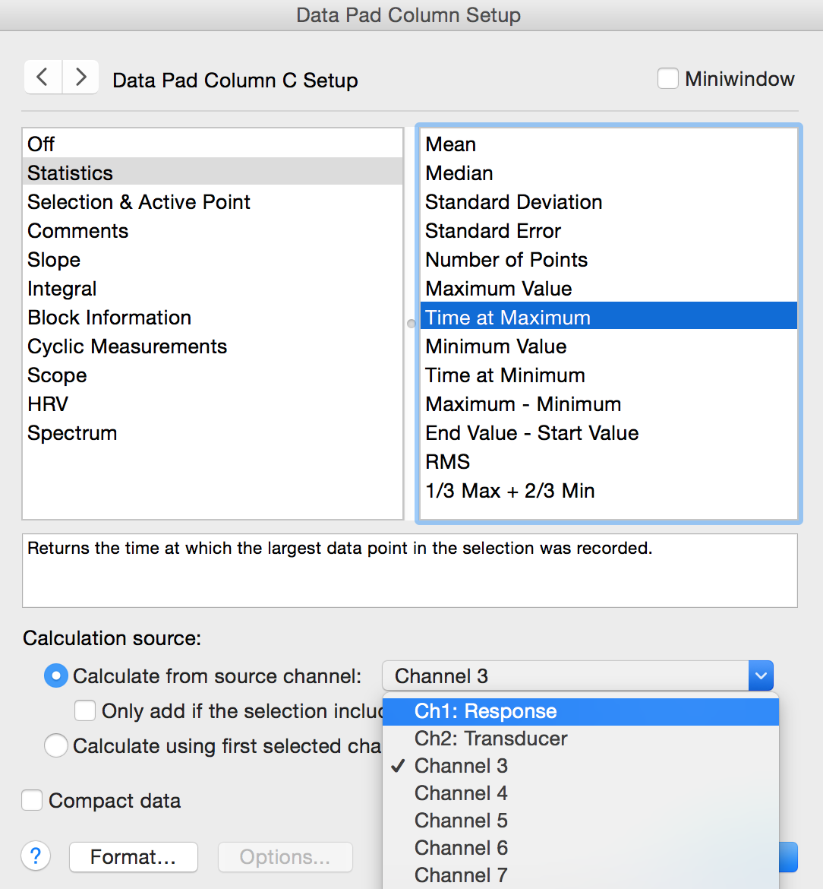
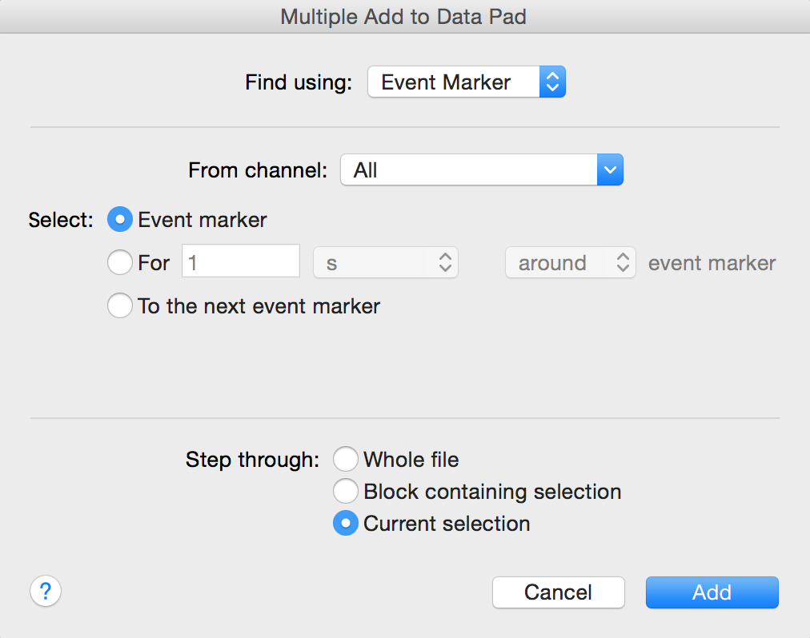

# Quicklinks

You can view and download the [lab notebook here](./Reflexes_notebook.md). 

- [Background](#background)
- [Required Equipment](#required-equipment)
- [Procedure](#procedure)
  - [Section 1: Reflexes](#section-1-reflexes)
    - [Exercise 1: The Myotatic Reflex](#exercise-1-the-myotatic-reflex)
    - [Exercise 2: The Pupillary Reflex](#exercise-2-the-pupillary-reflex)
    - [Exercise 3: Reflex Contraction of the Palmaris Brevis Muscle](#exercise-3-reflex-contraction-of-the-palmaris-brevis-muscle)
  - [Section 2: Reaction Times](#section-2-reaction-times)
    - [Exercise 4: Reaction Time to a Visual Cue](#exercise-4-reaction-time-to-a-visual-cue)
    - [Exercise 5: Reaction Time with a Warning](#exercise-5-reaction-time-with-a-warning)
    - [Exercise 6: Reaction Time to Predictable Cues](#exercise-6-reaction-time-to-predictable-cues)
    - [Exercise 7: Reaction Time with a Distracting Task](#exercise-7-reaction-time-with-a-distracting-task)
    - [Exercise 8: Reaction Time to an Auditory Cue](#exercise-8-reaction-time-to-an-auditory-cue)

# Reflexes & Reaction Times

In this experiment, you will investigate your reflexes and reaction times in response to a variety of stimuli and under a variety of conditions. You will examine some simple and complex reflexes from a volunteer and look at reaction times from a volunteer given harmless visual and auditory cues.

# Background

### Reflexes

Animal nervous systems exist to detect changes in the internal and external environments and respond. They do this by:

1. Receive the stimulus signal (in neurons or special receptor cells),
2. **Transduce** that signal to the nervous system's electro-chemical language,
3. Carry those signals on sensory neurons as action potentials to the central nervous system,
4. Integrate those signals with others,
5. "Decide" how to appropriately respond so that homeostasis might be maintained,
6. Send new signals down *efferent* (or *motor*) neurons to targets known as
7. **Effectors**, which carry out the commands to respond.

For example, if the response requires activation of a skeletal muscle, a series of action potentials is sent that cause muscle contraction and a movement of one or more parts of the body.

In some cases, the response needs to be quick enough that involving higher-order brain regions is either unnecessary, or would be too slow. In these cases, limiting the number of synapses to the minimum needed and completely automating the response produces a **reflex**. For example, a tap on the patellar ligament produces the knee-jerk, or myotatic, reflex. A simple spinal reflex like the myotatic reflex is produced via single synapses between sensory axons and motor neurons. The essential central circuitry for this reflex is confined to the spinal cord (Figure 1), though information also passes to the brain.

{:width="405" height="269"}

*Figure 1. Myotatic Reflex*

The myotatic reflex employs only two neurons. Striking the patellar ligament just below the patella stretches the quadriceps muscle. This stimulates sensory receptors in the muscle that trigger an action potential in a sensory axon whose cell body lies in the dorsal root ganglion in the lumbar region of the spinal cord. The sensory axon synapses directly with a motor neuron that conducts the impulse to the quadriceps, triggering contraction. In everyday life this reflex helps maintain the upright posture; if your brain "forgets" to tell your quadriceps to keep your knees extended, they would stretch quickly and cause the contraction reflex.

Sensory information also ascends to higher centers, but the brain is not necessary or required for many simple reflex functions.

{:width="236" height="236"}

*Figure 2. Pupillary Reflex*

More complex reflexes usually involve additional cells, such as interneurons and more than one population of motor neurons. This results in a longer delay between stimulus reception and the more complex response. One example of this is the pupillary, or direct light, reflex, which involves four neurons that connect the retina to the midbrain and then convey information back to the ciliary muscle in the eye. When light is focused upon the eye, the pupillary sphincter muscle in the iris constricts reducing the diameter of the pupil. At the same time, the pupillary sphincter muscle of the other eye constricts too, causing the consensual light reflex (Figure 2). This pupillary constriction is known as miosis (from Greek *meiosis* = diminution), pupillary dilatation is called mydriasis.

The flexion withdrawal reflex (Figure 3) mediates the withdrawal of a limb from a **painful** stimulus and is not studied in human volunteers for obvious reasons. However, a little-known reflex exists involving an obscure muscle in the hand - the palmaris brevis muscle - that shares some features of the flexion reflex. Like the other reflex pathways, local circuit neurons in the flexion reflex pathway receive converging inputs from several different sources, including cutaneous receptors, other spinal cord interneurons, and upper motor neuron pathways.

{:width="262" height="282"}

*Figure 3. Flexion Reflex*

### Reaction Times

**Reflexes** are *involuntary*. Voluntary reactions to a cue are considerably more complicated than reflexes. They require higher brain functions, rather than relying on low-level neuronal circuitry. During a voluntary reaction, such as swinging a bat at a thrown ball, a signal from your eyes sends a message to a part of your brain that controls your muscles. Your brain must then send a signal to your muscles, telling them to swing. Although it takes some time for the signal to travel along each nerve, the major delay in your reaction time occurs at the synapses between the different neurons involved.

While reaction times vary, the generally accepted figures for mean simple reaction times for college-age individuals are estimated as:
+  190 ms for visual stimuli (includes 20-40 ms for the sensory signal to reach the brain)
+  150 ms for sound stimuli (includes 8-10 ms for the sensory signal to reach the brain)
+  155 ms for touch stimuli

Many different factors can affect an individual's reaction time. The following table lists some of the factors to take into consideration:

| **Factor**  | **Effect** | **Description**                                                                                                                                                                                   |
|-----------|-------|------------------------------------------------------|
| Age         | **±**      | For both males and females, reaction time **shortens** from infancy into late 20s, then increases slowly until the 50s and 60s, and then lengthens faster as the person gets into his 70s and beyond. |
| Arousal     | **±**      | Reaction time is fastest with an intermediate level of arousal, and deteriorates when the subject is either too relaxed or too tense.                                                             |
| Distraction | **+**      | Distractions increase reaction time significantly, especially in younger individuals.                                                                                                             |
| Gender      | **±**      | Males generally have faster reaction times than females.                                                                                                                                          |
| Practice    | **-**      | Practice at a task decreases reaction time.                                                                                                                                                       |
| Errors      | **+**      | When a volunteer makes an error (like pressing the button before the stimulus is presented), subsequent reaction times are slower likely due to the subject being more cautious.                  |
| Fatigue     | **+**      | Reaction time deterioration due to fatigue is more marked when the task is complicated than when it is simple. Mental fatigue, especially sleepiness, has the greatest effect.                    |
| Punishment  | **-**      | Shocking a subject when he reacts slowly does shorten reaction time (we will not replicate these experiment for obvious reasons).                                                                 |
| Drugs       | **±**      | Stimulants tend to decrease reaction times to a point, but see arousal above. Depressants often increase reaction times.                                                                          |
| Warnings    | **-**      | Generally, reaction times are faster when the subject has been warned that a stimulus will arrive soon.                                                                                           |

# Required Equipment

-   LabChart software
-   PowerLab Data Acquisition Unit
-   Goniometer
-   Tendon Hammer
-   Push Button Switch
-   Finger Pulse Transducer
-   Small flashlight (or phone flashlight)
-   Medical tape

# Procedure

# Section 1: Reflexes

### Exercise 1: The Myotatic Reflex

In this exercise, you will observe the myotatic reflex in a relaxed volunteer by stimulating the patellar tendon and will observe the effects of other activity on the reflex.

1.  Make sure the PowerLab is turned **off** and the USB cable is
connected to the computer.

2.  Connect the Tendon Hammer to Input 1 and the Goniometer (Joint Angle
Sensor) to Input 2 on the front panel of the PowerLab. The hardware needs to be connected before you open the settings file.

3.  Attach the Goniometer to the volunteer's leg so that is the centered on the knee joint and adjust the straps so they are comfortably snug. Make sure the volunteer has a bare leg around the knee (Figure 4).

4.  Turn on the PowerLab.

{:width="232" height="181"}

*Figure 4. Goniometer Setup*

5.  Launch LabChart and open the settings file "Knee Jerk Settings" from the **Experiments** tab in the **Welcome Center**. It will be located in the folder for this experiment.

6.  Have the volunteer sit in a relaxed position and cross the leg that has the Goniometer attached over the other leg. Make sure his/her foot is free to swing backward and forward.

7.  With the Tendon Hammer, tap the patellar tendon just below the knee to elicit the myotatic, or knee jerk, response. Practice this exercise a few times so that you are comfortable in getting a reliable response.

8.  **Start** recording. Using the Tendon Hammer, tap the patellar
tendon of the volunteer. Repeat this four more times, so that you have five blocks of data.

9.  Now have the volunteer perform the Jendrassik maneuver. To do this, have the volunteer cup and link the fingers of both hands, and then strongly pull outwards across the chest. While the volunteer performs the maneuver, use the Tendon Hammer to tap the patellar tendon. Add a **comment** with "Jendrassik" when you tap the tendon. Record a total of five responses.

10. **Save your data** when you are finished recording.

#### Analysis

1.  Examine the data in the Chart View. **Autoscale**, if necessary. You will analyze and compare the latency and change in leg angle under normal conditions and while performing the Jendrassik maneuver.

2.  Scroll to the first block of data performed under normal conditions. Use the **Waveform Cursor** to measure the time between the stimulus and the start of the muscle contraction (the latency). Move the cursor to the point where the Goniometer trace starts to deflect. Record the latency in Table 1 of the [Lab Notebook](./Reflexes_notebook.md) under the heading "Latency"

3.  Measure the amplitude of the knee jerk response for the same data by placing the **Marker** on the baseline data in the Angle channel and the **Waveform Cursor** on the peak of the waveform. You must return the Marker to its dock before proceeding to the next block. Record the angle in Table 1 of the Data Notebook under the heading "Angle" on page 13.

4.  Repeat this procedure for all of the data blocks completed in the exercise.

### Exercise 2: The Pupillary Reflex

In this exercise, you will examine the pupillary reflex and related effects in the volunteer. The PowerLab and LabChart are not needed for this exercise.

1.  Shade the volunteer's eyes for about 15 seconds.

2.  Shine a light into one eye, and record the response of that eye in the lab notebook.

3.  Repeat steps 1 and 2, but record the response of the pupil in the unstimulated eye in the lab notebook.

4.  With normal lighting, have the volunteer look into the distance and then at an object held about 10 cm from the eye. Record what happens to the pupils in the Data Notebook.

### Exercise 3: Reflex Contraction of the Palmaris Brevis Muscle

In this exercise, you will examine the reflex contraction of the palmaris brevis muscle in the hand. The PowerLab and LabChart are not needed for this exercise. Everyone in the group can complete this exercise simultaneously.

1.  Cup your hand, as though for drinking water. Note the dimpling of
the skin along the ulnar border (Figure 5). This dimpling is the action of the palmaris brevis muscle.

***Note:** In some people, it is difficult to see the dimpling of the skin. Reflex effects will then be hard to demonstrate.*

{:width="363" height="190"}

*Figure 5. Palmaris Brevis Muscle*

11. With the palm of your hand facing up and the hand relaxed, press your fingernail over the pisiform bone (Figure 5). Firm pressure causes a reflex contraction of the palmaris brevis muscle.

12. Now try to find other bony prominences in the hand at which the reflex can be elicited.

13. Attempt to contract the palmaris brevis muscle voluntarily, without moving your little finger. Most people find this difficult or impossible. However, with extensive practice, the movement can be learned.

14. Record all your observations in the Lab notebook.

# Section 2: Reaction Times

### Exercise 4: Reaction Time to a Visual Cue

In this exercise, you will measure the volunteer's reaction time to a visual cue.

1.  Disconnect the Tendon Hammer and Goniometer from the PowerLab.

2.  Connect the Push Button Switch to Input 1 and the Finger Pulse Transducer to Input 2 on the front panel of the PowerLab (Figure 6). The hardware needs to be connected **before** you open the settings file.

{:width="309" height="263"}

*Figure 6. Equipment Setup for PowerLab 26T*

1.  Wrap the Velcro strap around the Finger Pulse Transducer to cover its diaphragm. This protects the transducer from hard tapping.

1.  Place the Finger Pulse Transducer on the laboratory bench with the diaphragm facing up. Make sure it is in a place where it will not be bumped accidentally. Keep the transducer in place with a piece of medical tape across the cable.

1.  Click the "Home" button on the lower left corner of the screen. Open the settings file "Reaction Time Settings" from the **Experiments** tab in the **Welcome Center**. It will be located in the folder for this experiment. Make sure your data from Exercise 1 is saved.

1.  Instruct the volunteer to click the Push Button Switch as soon as he/she sees you tap the Finger Pulse Transducer. Hold your hand over the transducer, but do not touch it.

1.  **Start** recording.

***Note:** The system will record for 0.75 s when it receives a signal from the Finger Pulse Transducer. This should be long enough for the volunteer to respond by pressing the Push Button Switch. Recording will stop automatically after ten data blocks are recorded.*

8.  After a delay of 1-4 s, tap the Finger Pulse Transducer without warning the volunteer. Repeat this step a total of 10 times. Make sure the taps are given without warning and at unpredictable intervals in the range of 1-4 s.

9.  Right click in Channel 1 and select **Add Comment** from the pop up menu. Enter the comment "exercise 4" and **Add** the comment. Save your data, but do not close the file.

#### Analysis

1. Use **Scope View** to examine the data. Note that in Scope View each block of data is one page (Figure 7). **Autoscale**, if necessary.

{:width="533" height="255"}

*Figure 7. Reaction Time to a Visual Cue in Scope View*

2.  Select page 1, the first block of data for Exercise 4. Move the **Overlay Pages Slider** to the right to overlay the 10 blocks (pages) of data from this exercise (Figure 7). Note that there is some variability in the volunteer's reaction time.

3.  Move the **Waveform Cursor** until it is over the start of the
response. The time is shown above and to the right of the trace. This is the reaction time. Record the reaction time in Table 2 of the lab notebook under the heading "Visual Cue".

1.  Select Page 2 and repeat step 3 to measure reaction time.

2.  Repeat this procedure for all of the data blocks completed in the exercise.

1.  Find the mean and standard deviation of the reaction time by
deleting the longest and shortest values (and using the remaining eight values). Enter the mean and standard deviation in Table 2 at the bottom of the "Visual Cue" column.

### Exercise 5: Reaction Time with a Warning

In this exercise, you will measure the volunteer's reaction time to a visual cue given immediately after a verbal prompt.

1.  **Start** recording. The system will begin recording when it
receives a signal from the Finger Pulse Transducer.

2.  After a delay of 1-4 s, warn the volunteer verbally by saying "ready" immediately before tapping the transducer. The volunteer is to click the Push Button Switch as before. Repeat this for a total of 10 times. Make sure the taps are at unpredictable intervals in the range of 1-4 s. Recording will stop automatically after the 10 data blocks have been recorded.

3.  Right click in Channel 1 and select **Add Comment** from the pop up menu. Enter the comment "exercise 5" and **Add** the comment. Save your data, but do not close the file.

#### Analysis

1.  Use **Scope View** to examine the data for exercise 5. **Autoscale**, if necessary. Note that there is some variability in the volunteer's reaction time.

2.  Now that you know how to manually measure reaction time you can use LabChart to measure it for you and enter these values in the Data Pad.

3. Open the Data Pad. Double click on the top of the Channel 3 Column. This will open the Data Pad Column C Setup dialog (Figure 8). In the left-hand pane, choose **Statistics**. From the right-hand pane, select **Time at Maximum**. In the 'Calculate using this channel:' field, select 'Response' (the name of Channel 1).

{:width="336"     height="363"}

*Figure 8. Data Pad Column Setup Dialog -- click on the gray column header to open this dialog.*

1.  In Chart View **Highlight** the 10 blocks of data for this exercise. Select **Multiple Add to Data Pad** from the **Commands** menu. Select **Find using: Event marker**, and **Step through: Current selection** as shown in Figure 9 below.

{:width="349"     height="275"}

*Figure 9. Multiple Add to Data Pad dialog -- select **Event marker**.*

5.  Finally, in the Multiple Add to Data Pad dialog, click **Add**. The reaction times for each block will be added to the Data Pad. Record the reaction times in Table 2 of the Data Notebook under the heading "With Warning" on page 15 of this document.

6.  Find the mean and standard deviation of the reaction time by
deleting the longest and shortest values (and using the remaining eight values). Enter the mean and standard deviation in Table 2 at the bottom of the "With Warning" column on page 15.

### Exercise 6: Reaction Time to Predictable Cues

In this exercise, you will measure the volunteer's reaction time to a cue given at regular intervals.

1.  **Start** recording. The system will begin recording when it receives a signal from the Finger Pulse Transducer.

2.  Instead of a verbal warning, tap the Finger Pulse Transducer in a regular rhythm, such as every two seconds. The volunteer is to click the Push Button Switch as before. Repeat this for a total of 10 times. The LabChart software will record in the same manner as Exercise 4 and Exercise 5.

3.  Right click in Channel 1 and select **Add Comment** from the pop up menu. Enter the comment "exercise 6" and **Add** the comment. Save your data, but do not close the file.

#### Analysis

1.  Use **Scope View** to examine the data for exercise 6. **Autoscale**, if necessary. Note the variability in the volunteer's reaction time.

2.  In Chart View **Highlight** the 10 blocks of data for this exercise. Open the Data Pad. Select **Multiple Add to Data Pad** from the **Commands** menu. The reaction times for each block will be added to the Data Pad. Record the reaction times in Table 2 of the Data Notebook under the heading "Predictable".

3.  Find the mean and standard deviation of the reaction time by
deleting the longest and shortest values (and using the remaining eight values). Enter the mean and standard deviation in Table 2 at the bottom of the "Predictable" column.

### Exercise 7: Reaction Time with a Distracting Task

In this exercise, you will measure the volunteer's reaction time while they are doing mental math.

1.  **Start** recording. The system will begin recording when it
receives a signal from the Finger Pulse Transducer.

2.  Ask the volunteer to count down from 100 by 7s repeatedly as fast as possible. The volunteer should say each number aloud. For example, the volunteer will say 100, 93, 86, etc.

3.  After a delay of 1-4 s, tap the Finger Pulse Transducer without warning the volunteer. The volunteer is to click the Push Button Switch as before. Repeat this step a total of 10 times. Make sure the taps are given without warning and at unpredictable intervals in the range of 1-4 s. The LabChart software will record in the same manner as before.

4.  Right click in Channel 1 and select **Add Comment** from the pop up menu. Enter the comment "exercise 7" and **Add** the comment. Save your data, but do not close the file.

#### Analysis

1.  Use **Scope View** to examine the data for exercise 7.
**Autoscale**, if necessary. Note the variability in the volunteer's reaction time.

1.  In Chart View **Highlight** the 10 blocks of data for this exercise. Open the Data Pad. Select **Multiple Add to Data Pad** from the **Commands** menu. The reaction times for each block will be added to the Data Pad. Record the reaction times in Table 2 of the Data Notebook under the heading "With Distraction".

2.  Find the mean and standard deviation of the reaction time by
deleting the longest and shortest values (and using the remaining eight values). Enter the mean and standard deviation in Table 2 at the bottom of the "With Distraction" column.

### Exercise 8: Reaction Time to an Auditory Cue

In this exercise, you will measure the volunteer's reaction time to a sound.

1.  Have the volunteer face away from the monitor and Finger Pulse Transducer to avoid visual cues. Make sure they are close enough to hear you tapping on the transducer. You want to tap on the transducer so a sound can be heard clearly, but you do not want to damage the transducer. Practice a couple times to make sure your method is heard by the volunteer.

2.  **Start** recording. The system will begin recording when it receives a signal from the Finger Pulse Transducer.

3.  After a delay of 1-4 s, tap the Finger Pulse Transducer without warning the volunteer. The volunteer is to click the Push Button Switch as soon as the tap on the Finger Pulse Transducer is heard. Repeat this step a total of 10 times. Make sure the taps are given without warning and at unpredictable intervals in the range of 1-4 s. The LabChart software will record in the same manner as before.

4.  Right click in Channel 1 and select **Add Comment** from the pop up menu. Enter the comment "exercise 8" and **Add** the comment. Save your data.

#### Analysis 

1.  Use **Scope View** to examine the data for exercise 8. **Autoscale**, if necessary. Note the variability in the volunteer's reaction time.

2.  In Chart View **Highlight** the 10 blocks of data for this exercise. Open the Data Pad. Select **Multiple Add to Data Pad** from the **Commands** menu. The reaction times for each block will be added to the Data Pad. Record the reaction times in Table 2 of the Lab Notebook under the heading "Auditory Cue." .

3.  Find the mean and standard deviation of the reaction time by
deleting the longest and shortest values (and using the remaining eight values). Enter the mean and standard deviation in Table 2 at the bottom of the "Auditory Cue" column.