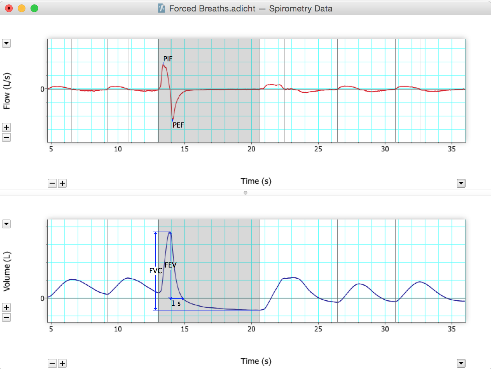

- [Background](#background)
- [Required Equipment](#required-equipment)
- [Procedure](#procedure)
  - [Equipment Setup](#equipment-setup)
  - [Exercise 1: Familiarize Yourself with the Equipment](#exercise-1-familiarize-yourself-with-the-equipment)
  - [Exercise 2: Lung Volumes and Capacities](#exercise-2-lung-volumes-and-capacities)
  - [Exercise 3: Pulmonary Function Tests](#exercise-3-pulmonary-function-tests)
  - [Exercise 4: Simulating Airway Obstructions](#exercise-4-simulating-airway-obstructions)
- [Analysis](#analysis)
- [Appendix: Vital Capacities in Healthy Individuals](#appendix-vital-capacities-in-healthy-individuals)

# Respiratory Airflow & Volume
In this experiment, you will be introduced to the Spirometry Extension for LabChart as a technique for recording respiratory variables and analyzing a data trace to derive respiratory parameters. You will examine lung volumes and capacities, basic tests of pulmonary function, and simulate an airway obstruction. *Written by staff of ADInstruments.*

# Background
Gas exchange between air and blood occurs in the alveolar air sacs. The efficiency of gas exchange is dependent on ventilation. Cyclical breathing movements alternately inflate and deflate the alveolar air sacs (Figure 1). Inspiration provides the alveoli with some fresh atmospheric air, and expiration removes some of the stale air, which has reduced oxygen and increased carbon dioxide concentrations.

{:width="374" height="277"}

*Figure 1. Basic Lung Anatomy* 

Spirometry is becoming more important as respiratory diseases are increasing worldwide. Spirometry is the method of choice for a fast and reliable screening of patients suspected of having Chronic Obstructive Pulmonary Disease (COPD). COPD is the 12^th^ leading cause of death worldwide and the 5^th^ leading cause in Western countries. Studies suggest COPD could climb to be the 3^rd^ leading killer by 2020. Most COPD cases are completely avoidable as 85-90% of cases are caused by tobacco smoking. Asthma is another respiratory disease and can be confused with COPD. People with asthma can experience a shortness of breath (dyspnea), wheezing, coughing, and tightness in their chest. In these people, the bronchi are always red and inflamed, even when they are not suffering an asthma attack. During an attack, the airways constrict and become filled with mucus. This can make physical activity difficult. Many important aspects of lung function can be determined by measuring airflow and the corresponding changes in lung volume. In the past, this was commonly done by breathing into a bell spirometer, in which the level of a floating bell tank gave a measure of changes in lung volume. Flow, F, was then calculated from the slope (rate of change) of the volume, V:

$$ F = \frac{dV}{dt} $$

More conveniently, airflow can be measured directly with a pneumotachometer (from Greek roots meaning "breath speed measuring device"). The PowerLab pneumotachometer is shown  Figure 2.  

{:width="377" height="190"}
*Figure 2. The PowerLab Pneumotachometer* 

Several types of flow measuring devices are available and each type has advantages and disadvantages. The flow head you will use today is a "Lilly" type that measures the difference in pressure either side of a mesh membrane with known resistance. This resistance gives rise to a small pressure difference proportional to flow rate. Two small plastic tubes transmit this pressure difference to the Spirometer Pod, where a transducer converts the pressure signal into a changing voltage that is recorded by the PowerLab and displayed in LabChart. The volume, V, is then calculated as the integral of flow:

$$ V = \int F dt $$

This integration represents a summation over time. The volume traces you will see in LabChart during the experiment are obtained by adding successive sampled values of the flow signal and scaling the sum appropriately. The integral is initialized to zero every time a recording is started.  A complication in the volume measurement is caused by the difference between ambient temperature and the air exhaled from the lungs, which is at body temperature. Gas expands with warming. Therefore, if the ambient temperature is cooler than body temperature, you will breathe out a larger volume of air because the air is warmed in the body. The volume of air expired can also be creased by humidification, which happens in the alveoli. Since you breathe out a larger volume of air than you breathe in, the volume data trace drifts in the expiratory direction. To reduce the drift, the flow has to be integrated separately during inspiration and expiration, with the inspiratory volume being corrected by a factor related to the BTPS factor (body temperature, atmospheric pressure, saturated with water vapor). Computer software corrections used in the Spirometry Extension can reduce drift but cannot eliminate it.  

Spirometry allows many components of pulmonary function to be visualized, measured, and calculated (Figure 3). Respiration consists of repeated cycles of inspiration followed by expiration. During the respiratory cycle, a volume of air is drawn to and then expired from the lungs. This volume is the tidal volume ($V_T$). In normal ventilation, the breathing frequency (*f*) is approximately 15 respiratory cycles per minute. This value varies with the level of activity.  
The product of *f* and $V_T$ is the expired minute volume ($V_E$), the amount of air exhaled in one minute of breathing. This parameter also changes according to the level of activity. Even when a person exhales completely, there is still air left in the lungs. This leftover air is the residual volume (*RV*), which cannot be measured by spirometry. 

{:width="422" height="240"}
*Figure 3. Lung Volumes and Capacities* 

Terms You Should Familiarize Yourself with: 

<table> <colgroup> <col style="width: 42%" /> <col style="width: 28%" /> <col style="width: 28%" /> </colgroup> <thead> <tr class="header"> <th><strong>Term</strong></th> <th>
<strong>Abbreviation/</strong>
 
<strong>Symbol</strong>
</th> <th><strong>Units</strong></th> </tr> </thead> <tbody> <tr class="odd"> <td>Respiratory Rate</td> <td>RR</td> <td>Breaths/min (BPM)</td> </tr> <tr class="even"> <td>Expired Minute Volume</td> <td>VE = RR x VT</td> <td>L/min</td> </tr> <tr class="odd"> <td><strong>Lung Volumes</strong></td> <td></td> <td></td> </tr> <tr class="even"> <td>Tidal Volume</td> <td>VT</td> <td>L</td> </tr> <tr class="odd"> <td>Inspiratory Reserve Volume</td> <td>IRV</td> <td>L</td> </tr> <tr class="even"> <td>Expiratory Reserve Volume</td> <td>ERV</td> <td>L</td> </tr> <tr class="odd"> <td>Residual Volume</td> <td>RV (predicted)</td> <td>L</td> </tr> <tr class="even"> <td><strong>Lung Capacities</strong></td> <td></td> <td></td> </tr> <tr class="odd"> <td>Inspiratory Capacity</td> <td>IC = VT + IRV</td> <td>L</td> </tr> <tr class="even"> <td>Expiratory Capacity</td> <td>EC = VT + ERV</td> <td>L</td> </tr> <tr class="odd"> <td>Vital Capacity</td> <td>VC = IRV + ERV + VT</td> <td>L</td> </tr> <tr class="even"> <td>Functional Residual Capacity</td> <td>FRC = ERV + RV</td> <td>L</td> </tr> <tr class="odd"> <td>Total Lung Capacity</td> <td>TLC = VC + RV</td> <td>L</td> </tr> <tr class="even"> <td><strong>Pulmonary Function Tests</strong></td> <td></td> <td></td> </tr> <tr class="odd"> <td>Peak Inspiratory Flow</td> <td>PIF</td> <td>L/min</td> </tr> <tr class="even"> <td>Peak Expiratory Flow</td> <td>PEF</td> <td>L/min</td> </tr> <tr class="odd"> <td>Forced Vital Capacity</td> <td>FVC</td> <td>L</td> </tr> <tr class="even"> <td>Forced Expired Volume in One Second</td> <td>FEV1</td> <td>L</td> </tr> <tr class="odd"> <td>%FVC Expired in One Second</td> <td>FEV1 / FVC x 100</td> <td>%</td> </tr> </tbody> </table>

# Required Equipment
-   LabChart software with Spirometry Extension
-   PowerLab Data Acquisition Unit
-   Spirometer Pod
-   Respiratory Flow Head (1000 L/min) with connection tubes
-   Clean-bore Tubing & Tubing Adapter
-   Disposable Filters
-   Reusable Mouthpieces
-   Nose Clips
-   Tape measure or wall chart for measuring height
-   Reading material
-   Medical tape
-   Sharpened pencil

# Procedure

### {:width="16" height="16"} If you are suffering from a respiratory infection, do not volunteer for this experiment.

## Equipment Setup
1.  Make sure the PowerLab is turned off and the USB cable is connected to the computer.
2.  Connect the Spirometer Pod to Input 1 on the front panel of the
PowerLab (Figure 4). Turn on the PowerLab. 

***Note:** Since the Spirometer Pod is sensitive to temperature and tends to drift during warm-up, it is recommended the PowerLab (and therefore the Spirometer Pod) is turned on for at least 10 minutes before use. To prevent temperature drift, place the Spirometer Pod  beside the PowerLab (not on top), away from the PowerLab power supply to avoid heating.*

{:width="360" height="248"}
*Figure 4. Equipment Setup for PowerLab 26T*

3.  Connect the two plastic tubes from the Respiratory Flow Head to the short pipes on the back of the Spirometer Pod. Attach Clean-bore Tubing, a Filter, and a Mouthpiece to the Flow Head (Figure 4). DO NOT push the clean bore tubing on to the flow head too tightly!!

***Note:** A clean Mouthpiece and Filter should be supplied for each volunteer.*

## Exercise 1: Familiarize Yourself with the Equipment
In this exercise, you will learn the principles of spirometry and how integration of the flow signal gives a volume.
### Zeroing the Spirometer Pod
The Spirometer Pod must be zeroed **before starting each exercise**. The Flow Head must be left undisturbed on the table during the zeroing process.
1.  Launch LabChart and open the settings file "Airflow and Volume
Settings" from the **Experiments** tab in the **Welcome Center**. It will be located in the folder for this experiment. 
1.  Select **Spirometer Pod** from the Channel 1 Channel Function pop-up menu. Make sure the Range is 500 mV and the Low Pass is 10 Hz; then select **Zero**.
1.  When the value remains at 0.0 mV, have the volunteer pick up the flow head and breathe out gently through the Flow Head, and observe the signal (Figure 5). If the signal shows a downward deflection (it is negative), you can return to the Chart View. If the signal deflects upward, you need to invert it. Tick the Invert check box. 

{:width="335"     height="250"} 
***Note**: The equipment can also be zeroed by clicking on the Setup menu and selecting "zero all inputs".* 
*Figure 5. Spirometer Pod Dialog with Downward Deflection*
2.  Leave this dialog open and have the volunteer get the noise clip in place and sit comfortably so they can not view the screen. The next exercise will allow them to get used to breathing through this apparatus.
### Using the Equipment
1.  With the flow head on the bench, **Zero** the Spirometer,
2.  Have the volunteer put the mouthpiece in their mouth and hold the
Flow Head carefully with both hands. The two plastic tubes should be pointing upward.

{:width="383"     height="278"}
*Figure 6. Proper Positioning of the Flow Head*

Put the nose clip on the volunteer's nose. This ensures that all air breathed passes through the Mouthpiece, Filter, and Flow Head (Figure 6). 
1.  After the volunteer becomes accustomed to the apparatus and begins breathing normally, you are ready to begin. 

##### If performing Volume Correction

1.  With the flow head on the bench, **Zero** the Spirometer,
2.  Have the volunteer replace the noise clip and put the mouthpiece in their mouth and hold the Flow Head as before.
1.  **Start** recording. Have the volunteer take a few normal breaths, then perform a full exhalation (this should be sigh, not a gasp or a forced vital capacity procedure) and then breathe normally for about one minute. At the end of one minute, have the volunteer perform another full exhalation. Observe the data being recorded in the "Flow" channel; it should resemble Figure 7. 

{:width="575"     height="165"} *Figure 7. Proper volume correction Procedure. Note, the two full exhalations must be done as consistently as possible as the lowest points on the flow channel are used to correct the Volume calculation. Note this procedure is optional, check with your instructor.* 

2.  **Stop** recording. The volunteer can stop breathing through the Flow Head and can remove the Nose Clip. 

##### If NOT Performing volume correction:

1.  With the flow head on the bench, **Zero** the Spirometer,
2.  Have the volunteer replace the noise clip and put the mouthpiece in
their mouth and hold the Flow Head as before.
1.  **Start** recording. Have the volunteer breathe normally for about
one minute.
1.  **Stop** recording. The volunteer can stop breathing through the Flow Head and can remove the Nose Clip.

### Setting Up the Spirometry Extension
The Spirometry Extension processes the raw voltage signal from the Spirometer Pod, applies a volume correction factor to improve accuracy, and displays calibrated Flow (L/s) and Volume (L) traces. It takes over from Units Conversion. The trace you recorded in this exercises will provide reference points for the Spirometry Extension that allow it to calculate and perform corrections on the trace.
1.  Drag across the Time axis at the bottom of the Chart View to **select** the data you recorded. Select **Spirometry Flow** from the Channel 1 Channel Function pop-up menu. Make sure the settings are the same as those in Figure 8, then click OK.

{:width="260" height="190"}
*Figure 8. Spirometry Flow Dialog*

1. Select **Spirometry Volume** from the Channel 2 Channel Function pop-up menu. Make sure Channel 1 is selected in the Spirometry Flow Data pop-up menu (Figure 9). 

{:width="248"     height="284"}
*Figure 9. Spirometry Volume Dialog* 

##### If NOT Performing volume correction:

2.  Click OK
3.  Select **Set Scale** from the Scale pop-up menu in the Amplitude
axis for the "Flow" channel. Make the top value 15 L/s and the bottom value -15 L/s and proceed to exercise 2 

##### If Performing volume correction:

1.  Click the Apply Volume Correction checkbox to turn it on. The Calculated volume ratio from selection should be between 1.000 and 1.100, if it is outside of this range, repeat the procedure or check with your instructor.
2.  Then select **Apply** to allow the extension to use the volume correction ratio that is has calculated from your data. The Chart View should now appear with calculated volume data on Channel 2. After making these changes, click OK.
3.  Select **Set Scale** from the Scale pop-up menu in the Amplitude
axis for the "Flow" channel. Make the top value 15 L/s and the bottom value -15 L/s.

## Exercise 2: Lung Volumes and Capacities
In this exercise, you will examine the respiratory cycle and measure changes in flow and volume.
1.  **Zero** the Spirometer Pod again, using the same procedure as before. Remember to leave the Flow Head undisturbed on the bench during the process.
1.  Have the volunteer face away from the monitor and read. This will prevent the volunteer from consciously controlling their breathing during the exercise.
1.  When ready, **Start** recording. After two seconds, have the volunteer replace the Nose Clip and breathe normally into the Flow Head. Record normal tidal breathing for one minute. Add a **comment** with "normal tidal breathing" to the data trace.
1.  After the tidal breathing period (at the end of a normal tidal expiration), ask the volunteer to inhale as deeply as possible and then exhale as deeply as possible. Afterwards, allow the volunteer to return to normal tidal breathing for at least three breaths. **Stop** recording when finished.
1.  Position the cursor at the end of the deep breath. Right-click and select **Add Comment**. Add a **comment** with "lung volume > procedure" at the cursor position.
2.  **Save your data**.

## Exercise 3: Pulmonary Function Tests
In this exercise, you will measure parameters of forced expiration that are used in evaluating pulmonary function. Note that the Spirometry Extension is not intended for clinical evaluation of lung function.
1.  **Zero** the Spirometer Pod again, using the same procedure as before. Remember to leave the Flow Head undisturbed during the process. ***Note**: remember to zero the spirometer at the level it will be used (i.e. if the volunteer is standing, zero the device after the volunteer stands but before you connect the mouthpiece to the volunteer*
1.  Have the volunteer replace the Nose Clip and breathe normally into the Flow Head.
1.  **Start** recording. Add a **comment** with the volunteer's name.
2.  Prepare a comment with "forced breathing." Have the volunteer breathe normally for 30 seconds. Then ask the volunteer to inhale maximally and then exhale as forcefully, as quickly, and as fully as possible until no more air can be expired, then have the volunteer breathe normally for two to three breaths. Add the **comment**. **Stop** recording.
1.  Repeat steps 3-4 twice more, so that you have three separate forced
breath recordings (Figure 14).

{:width="497" height="280"}
*Figure 14. Sample Data of Forced Breaths*

1.  Repeat steps 1-4 for every person in your group. Replace the Filter,
Mouthpiece, and Nose Clip for each student. **Zero** the Spirometer Pod before each student begins the exercise. Make sure you add a **comment** with each volunteer's name when they begin the exercise.
1.  **Save your data**. Do not close the file.

## Exercise 4: Simulating Airway Obstructions
In this exercise, you will demonstrate the effects of bronchial obstructions, such as asthma, by making modifications to your equipment.
1.  Remove the Filter attachment from the Mouthpiece and Clean-bore Tubing.
1.  Cover the mouthpiece end of the filter with medical tape. Use a sharpened pencil to make a hole in the tape one centimeter in diameter. Reattach the Mouthpiece to the Filter, as in Figure 4.
1.  Attempt the pulmonary function tests with the obstructed airway. Repeat the entire procedure from Exercise 3, including recording from each student in the group.

# Analysis
## Exercise 2: Lung Volumes and Capacities
1.  Examine the normal tidal breathing data in the Chart View, and **Autoscale**, if necessary. Calculate how many breaths there are in a one-minute period (BPM). Record RR/min in Table 1 of the [Lab Notebook](./Respirometry_notebook.md) of this document.
2. Determine the volume of a single tidal inspiration by placing the **Marker** at the start of a normal tidal inspiration. Place the **Waveform Cursor** at the peak (Figure 10). The value shown in the Range/Amplitude display for Channel 2 is the tidal volume ($V_T$) for that breath. Record this value in Table 1 of the Data Notebook on page 14. 
 
{:width="351"     height="276"}
*Figure 10. Proper Placement of Marker and Waveform Cursor*

3.  Use the values for tidal volume and the number of breaths observed
over a one minute period to calculate the expired minute volume ($V_E$). Use the following equation: 

$$V_E = RR \times V_T \text{ (L/min)}$$

4.  Find the "lung volume procedure" comment in your data trace. Repeat steps 2-3 to determine the inspiratory reserve volume (IRV) (Figure 11) and expiratory reserve volume (ERV) (Figure 12).

***Note:** The Marker should be placed at the peak of a normal tidal inspiration for IRV, and it should be placed at the start of a normal tidal inspiration (trough) for ERV.*

5.  Calculate the inspiratory capacity (*IC*) using the following
equation: 

$$IC = V_T + IRV \text{ (L)} $$

1.  Calculate the expiratory capacity (*EC*) using the following equation:

$$EC = V_T + ERV \text{ (L)}$$

{:width="367" height="247"}
*Figure 11. Positioning of Marker and Waveform Cursor to Measure IRV*
{:width="380" height="256"}
*Figure 12. Positioning of Marker and Waveform Cursor to Measure ERV*

1.  Refer to the [Appendix](#appendix-vital-capacities-in-healthy-individuals) later in this document, and use the
tables provided to determine the volunteer's **predicted** vital capacity (VC). The predicted value varies according to the volunteer's sex, height, and age.
1.  Calculate the volunteer's measured VC using the experimentally derived values for IRV, ERV, and V~T~. Use the following equation: 

$$VC = IRV + ERV + V_T \text{ (L)}$$

4.  Residual volume (RV) is the volume of gas remaining in the lungs after a maximal expiration. The RV cannot be determined by spirometric recording. Using the following equation, determine the predicted RV value for the volunteer: 

$$RV = \text{predicted }VC \times 0.25 \text{ (L)}$$

5.  The total lung capacity (*TLC*) is the sum of the vital capacity and residual volume. Calculate the predicted *TLC* for the volunteer using the following equation: 

$$TLC = VC + RV \text{ (L)}$$
6.  Functional residual capacity (*FRC*) is the volume of gas remaining in the lungs at the end of a normal tidal expiration. Use the following equation: 

$$FRC = ERV + RV\text{ (L)}$$

7.  **Select** an area of the Chart View that contains normal breathing,
making sure to select across complete respiratory cycles. Select **Report** from the **Spirometry** menu. The Spirometry Report window contains various parameters calculated by the Spirometry Extension from the data selection (Figure 13). Copy the results for $V_E$, $V_T$, and *f* (which is *RR*) into the appropriate column in Table 1 of the [Lab Notebook](./Respirometry_notebook.md).

{:width="249"     height="389"}
*Figure 13. Spirometry Report*

Make sure you have entered all the values calculated into Table 1 of the [Lab Notebook](./Respirometry_notebook.md).

## Exercise 3: Pulmonary Function Tests
1.  Perform the analysis on your own Pulmonary Function test data.
2.  In the last data block of your LabChart recording for this exercise, move the **Waveform Cursor** to the maximal forced inspiration in "Flow." The absolute value displayed in the Range/Amplitude display is the peak inspiratory flow (*PIF*). Multiply the value by 60 to convert from L/s to L/min.
1.  From the flow data trace, measure the peak expiratory flow (*PEF*) for the forced expiration. Multiply the value by 60 to convert from L/s to L/min. Disregard the negative sign.
1.  To calculate the forced vital capacity (*FVC*), place the **Marker** on the peak inhalation of "Volume," and move the **Waveform Cursor** to the maximal expiration (Figure 14). Read off the result from the Range/Amplitude display, disregarding the delta symbol and negative sign.
1.  Return the Marker to its box. To measure forced expired volume in one second ($FEV_1$), place the **Marker** on the peak of the volume data trace, move the **Waveform Cursor** to a time 1.0 s from the peak, and read off the volume value. If you find it hard to adjust the mouse position with enough precision, a time value anywhere from 0.96 s to 1.04 s gives enough accuracy. Disregard the delta symbol and negative sign.

6. Return the Marker to its box. **Select** data from the last recorded data block for this exercise that includes a couple of normal breaths, the forced breath, and a few more normal breaths (Figure 14). Select **Data Window** from the **Spirometry** menu. The Spirometry Data window opens, showing the locations of *PIF*, *PEF*, *FVC*, and $FEV_1$. If the values are not displayed, you need to change the settings of the Spirometry Extension. Refer to step 7. If the values are displayed, refer to step 8. 

{:width="387"     height="291"}
*Figure 14. Spirometry Data Window, with the Locations of the Parameters*

7. Select **Settings** from the **Spirometry** menu (Figure 15). The default values are shown in Figure 15. You can adjust the Cycle Detection Level between 0.25% and 1.00% of the full range, and you can adjust the Forced Expiration Threshold between 1 and 2. Try different combinations until you see a Spirometry Data window like the one in Figure 14. 
{:width="375"     height="204"}
*Figure 15. Spirometry Settings Dialog with Default Values*

8.  With the Spirometry Data window open, select **Report** from the **Spirometry** menu. The report lists the values calculated for the parameters in Figure 14. Add these values to the proper column in Table 2 of the [Lab Notebook](./Respirometry_notebook.md).
2.  Repeat this analysis until all three forced breaths have been analyzed, both manually and with the Spirometry Extension.
1.  Calculate the percentage ratio of $FEV_1$ to FVC for your experimental and Spirometry Extension results. Use the maximum values of $FEV_1$ and *FVC*, and use the following equation: 

$$(FEV_1 / FVC) \times 100 \text{ (\%)}$$

1.  Record your values in Table 2 of the [Lab Notebook](./Respirometry_notebook.md).
2.  When each person in the group has completed their analysis, share your results. Record the values for the other group members in Table 3 of the [Lab Notebook](./Respirometry_notebook.md).
   
## Exercise 4: Simulating Airway Restrictions
1.  Perform the analysis on your own airway restriction test data.
2.  Repeat the entire Analysis for Exercise 3 using your data from Exercise 4.
3.  Record these values in Table 4 of the [Lab Notebook](./Respirometry_notebook.md).
4.  Record the values for the other group members in Table 5 of the [Lab Notebook](./Respirometry_notebook.md).
1. Compare the Flow volume loops for the forced breaths using the Flow Volume plot view from the Spirometry menu Figure 16. 

{:width="633"     height="203"}
*Figure 16. Flow volume loops from obstructed airway (left), and normal airway (right).Note be sure to set the X and Y axes to same range to make a meaningful comparison.*

## Appendix: Vital Capacities in Healthy Individuals
Height (cm)

{:width="624" height="253"}

*Table 1. Predicted Vital Capacities for Males* Height (cm)

{:width="624" height="254"}

*Table 2. Predicted Vital Capacities for Females*